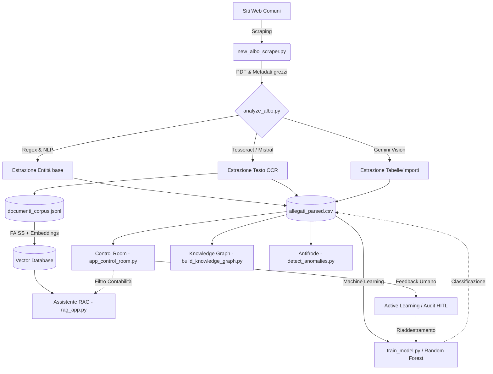

# 🏗️ Architettura del Sistema

Il progetto **Albo Pretorio Audit Delivery** è strutturato secondo un'architettura modulare "Data-Centric" e "AI-Augmented".

## Diagramma del Flusso Dati (Mermaid)

## Descrizione dei Moduli Core

1. **`analyze_albo.py` (Il Motore di Estrazione):** 
   Il cuore del sistema. Unifica parser PDF nativi, Tesseract OCR e LLM multimodal per estrarre il testo. Applica le `CATEGORY_RULES` per la classificazione e la funzione `is_accounting_relevant()` per il filtraggio di dominio.

2. **`rag_app.py` & `src/web/rag_chat.py` (Il Cervello RAG):**
   Gestisce la vettorializzazione dei chunk di testo usando FAISS. È equipaggiato con una `LLMFailoverRAGChain` che orchestra una coda di modelli (Gemini, Mistral, Ollama locale) per garantire tolleranza ai guasti (Rate Limiting). Applica il "Domain Filtering" escludendo a runtime gli atti non contabili.

3. **`app_control_room.py` (L'Interfaccia Direzionale):**
   Un'applicazione Streamlit che funge da Hub centrale. Legge i dati normalizzati per costruire grafici finanziari interattivi, esporre il Knowledge Graph e gestire il loop di feedback umano (HITL - Human in the loop) per aggiornare permanentemente il database.

4. **`detect_anomalies.py` (Analisi Comportamentale):**
   Script analitico che incrocia RUP, Fornitori e Importi per rilevare pattern sospetti basati sul D.Lgs 36/2023 (Frazionamenti, Smurfing, ecc.).

5. **`train_model.py` (Machine Learning):**
   Addestra una pipeline TF-IDF + Random Forest sulle descrizioni degli atti per prevederne la categoria, supportando l'apprendimento dai dati revisionati dagli operatori.