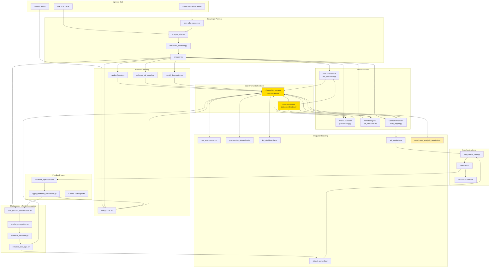

# Architettura del Sistema di Audit dell'Albo Pretorio

## Panoramica

Il sistema è organizzato in una architettura modulare a strati che consente l'elaborazione automatizzata degli atti pubblici presenti negli albi pretori comunali. L'architettura è stata recentemente estesa con un modulo di coordinamento centrale (CentralOrchestrator) che coordina i diversi moduli avanzati.

## Diagramma Architetturale

```mermaid
graph TB
    subgraph "Ingresso Dati"
        A1[Fonte Web Albo Pretorio] 
        A2[File PDF Locali]
        A3[Dataset Storici]
    end
    
    subgraph "Scraping e Parsing"
        B1[new_albo_scraper.py]
        B2[analyze_albo.py]
        B3[enhanced_extractor.py]
        B4[analyzer.py]
    end
    
    subgraph "Moduli Avanzati"
        C1[Risk Assessment<br/>risk_calculator.py]
        C2[Analisi Attuariale<br/>provisioning.py]
        C3[KPI Manageriali<br/>kpi_calculator.py]
        C4[Controllo Anomalie<br/>audit_engine.py]
    end
    
    subgraph "Machine Learning"
        D1[randomForest.py]
        D2[train_model.py]
        D3[enhance_ml_model.py]
        D4[model_diagnostics.py]
    end
    
    subgraph "Coordinamento Centrale"
        E1[CentralOrchestrator<br/>orchestrator.py]
        E2[DataCoordinator<br/>data_coordinator.py]
    end
    
    subgraph "Elaborazione e Post-elaborazione"
        F1[post_process_classification.py]
        F2[resolve_ambiguities.py]
        F3[enhance_metadata.py]
        F4[enhance_doc_type.py]
    end
    
    subgraph "Interfaccia Utente"
        G1[app_control_room.py]
        G2[Streamlit UI]
        G3[RAG Chat Interface]
    end
    
    subgraph "Output e Reporting"
        H1[risk_assessment.csv]
        H2[provisioning_attuariale.xlsx]
        H3[kpi_dashboard.xlsx]
        H4[allegati_parsed.csv]
        H5[atti_audited.csv]
        H6[coordinated_analysis_results.json]
    end
    
    subgraph "Feedback Loop"
        I1[feedback_operatore.csv]
        I2[apply_feedback_corrections.py]
        I3[Ground Truth Update]
    end

    A1 --> B1
    A2 --> B2
    A3 --> D2
    
    B1 --> B2
    B2 --> B3
    B3 --> B4
    
    B4 --> C1
    B4 --> C2
    B4 --> C3
    B4 --> C4
    B4 --> D1
    B4 --> D2
    B4 --> D3
    B4 --> D4
    
    B4 --> F1
    F1 --> F2
    F2 --> F3
    F3 --> F4
    
    C1 --> E1
    C2 --> E1
    C3 --> E1
    C4 --> E1
    D1 --> E1
    D2 --> E1
    D3 --> E1
    D4 --> E1
    F4 --> E1
    
    E1 --> E2
    E2 --> C1
    E2 --> C2
    E2 --> C3
    E2 --> C4
    
    E1 --> H1
    E1 --> H2
    E1 --> H3
    F4 --> H4
    C4 --> H5
    E1 --> H6
    
    H4 --> G1
    H5 --> G1
    G1 --> G2
    G2 --> G3
    
    G2 --> I1
    I1 --> I2
    I2 --> D2
    I2 --> F1
    
    style E1 fill:#ffdd00
    style E2 fill:#ffdd00
    style H6 fill:#ffeeaa
```

## Descrizione dei Componenti

### 1. Coordinamento Centrale (Nuovo)

Il modulo di **Coordinamento Centrale** è stato aggiunto per risolvere il problema dell'isolamento tra i diversi moduli avanzati. Include:

- **CentralOrchestrator**: Coordinatore che esegue i diversi moduli avanzati in sequenza ma con feedback reciproco, permettendo loro di scambiarsi informazioni e influenzarsi a vicenda.
- **DataCoordinator**: Sistema centralizzato per la gestione dei dati condivisi tra i moduli, con persistenza su disco e tracciamento delle modifiche.

### 2. Scraping e Parsing

Include i moduli responsabili dell'estrazione dei dati dagli albi pretori:

- **new_albo_scraper.py**: Estrae i documenti dagli albi pretori online
- **analyze_albo.py**: Analizza e struttura i documenti estratti
- **enhanced_extractor.py**: Estrattore avanzato di informazioni dai documenti
- **analyzer.py**: Componente di analisi testuale

### 3. Moduli Avanzati

Componenti specializzati per analisi specifiche:

- **Risk Assessment**: Valutazione del rischio associato ai procedimenti
- **Analisi Attuariale**: Calcolo di provvigioni e rischi finanziari
- **KPI Manageriali**: Indicatori di performance per la gestione
- **Controllo Anomalie**: Rilevamento di comportamenti irregolari

### 4. Machine Learning

Moduli dedicati all'apprendimento automatico:

- **randomForest.py**: Classificatore basato su Random Forest
- **train_model.py**: Addestramento dei modelli
- **enhance_ml_model.py**: Ottimizzazione dei modelli
- **model_diagnostics.py**: Diagnostiche avanzate dei modelli

### 5. Elaborazione e Post-elaborazione

Moduli per l'affinamento dei risultati:

- **post_process_classification.py**: Affinamento della classificazione
- **resolve_ambiguities.py**: Risoluzione delle ambiguità
- **enhance_metadata.py**: Arricchimento dei metadati
- **enhance_doc_type.py**: Classificazione avanzata dei tipi documentali

### 6. Interfaccia Utente

Componenti per l'interazione con l'utente:

- **app_control_room.py**: Dashboard Streamlit
- **Streamlit UI**: Interfaccia utente
- **RAG Chat Interface**: Interfaccia per interrogazioni basate su RAG

## Flusso di Esecuzione

Il sistema può essere eseguito in due modalità:

1. **Modalità Tradizionale**: Esecuzione sequenziale dei singoli moduli
2. **Modalità Coordinata**: Esecuzione tramite CentralOrchestrator che coordina tutti i moduli avanzati

Il nuovo modulo di coordinamento permette:
- Scambio di informazioni strutturato tra i moduli
- Feedback reciproco tra i risultati ottenuti
- Ciclo continuo di miglioramento basato sui risultati
- Persistenza coordinata dei risultati in formato strutturato

## Dipendenze

Il sistema è strutturato per minimizzare le dipendenze circolari e favorire la modularità. Il coordinatore centrale funge da intermediario tra i diversi componenti, evitando dipendenze dirette tra moduli specializzati.

## Sicurezza e Isolamento

Ogni modulo opera in modo isolato e sicuro. Il coordinatore centrale gestisce in modo sicuro lo scambio di dati tra i moduli, rispettando le norme di privacy e sicurezza.

## Performance e Scalabilità

L'architettura è progettata per essere scalabile. Il coordinatore centrale include meccanismi di caching e ottimizzazione per gestire grandi volumi di dati in modo efficiente.