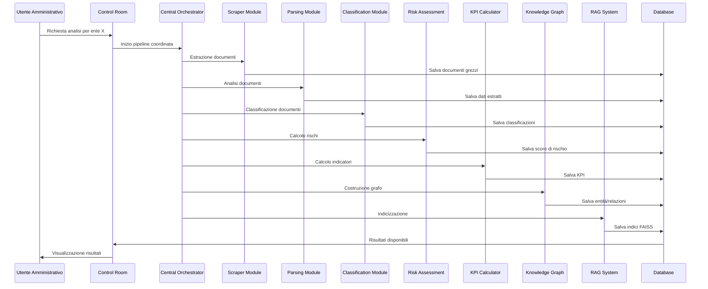

# Architettura del Sistema

## Panoramica

Il sistema è suddiviso in diversi moduli indipendenti ma interconnessi, progettati per consentire l'analisi, classificazione e audit dei documenti presenti negli albi pretori comunali italiani.

## Diagramma Architetturale

``mermaid
graph TB
    subgraph "Input Layer"
        A[Albo Pretorio Web] --> B[PDF Documents]
        C[Config Files] --> D[Environment Variables]
    end
    
    subgraph "Core Processing Layer"
        B --> E[Scraper Module]
        E --> F[Parsing Module]
        F --> G[Feature Extraction]
        G --> H[Classification Module]
        
        D --> I[Config Manager]
        I --> J[Enterprise Orchestrator]
    end
    
    subgraph "Advanced Analysis Layer"
        H --> K[Risk Assessment]
        H --> L[KPI Calculation]
        H --> M[ML Diagnostics]
        H --> N[Audit Engine]
    end
    
    subgraph "Data Coordination Layer"
        O[Data Coordinator] --> P[Shared Data Store]
        P --> Q[Caching Layer]
    end
    
    subgraph "Output Layer"
        K --> R[Risk Reports]
        L --> S[KPI Dashboards]
        M --> T[ML Metrics]
        N --> U[Audit Logs]
        R --> V[Structured Outputs]
        S --> V
        T --> V
        U --> V
    end
    
    subgraph "Knowledge Graph Layer"
        W[Entity Extraction] --> X[Knowledge Graph Builder]
        X --> Y[Graph Storage]
        Y --> Z[Graph Queries]
    end
    
    subgraph "RAG Layer"
        AA[FAISS Index] --> BB[RAG Application]
        BB --> CC[Query Interface]
    end
    
    subgraph "UI Layer"
        DD[Control Room UI] --> EE[RAG Chat Interface]
        FF[Dashboard] --> GG[Reporting UI]
    end
    
    J --> E
    J --> F
    J --> H
    J --> K
    J --> L
    J --> M
    J --> N
    J --> O
    J --> W
    J --> AA
    
    P --> W
    P --> X
    P --> AA
    P --> BB
    P --> DD
    P --> FF
```

## Flusso Dati Principale


```mermaid
sequenceDiagram
    participant User as Utente Amministrativo
    participant ControlRoom as Control Room
    participant Orchestrator as Central Orchestrator
    participant Scraper as Scraper Module
    participant Parser as Parsing Module
    participant Classifier as Classification Module
    participant Risk as Risk Assessment
    participant KPI as KPI Calculator
    participant Graph as Knowledge Graph
    participant RAG as RAG System
    participant DB as Database
    
    User->>ControlRoom: Richiesta analisi per ente X
    ControlRoom->>Orchestrator: Inizio pipeline coordinata
    Orchestrator->>Scraper: Estrazione documenti
    Scraper->>DB: Salva documenti grezzi
    Orchestrator->>Parser: Analisi documenti
    Parser->>DB: Salva dati estratti
    Orchestrator->>Classifier: Classificazione documenti
    Classifier->>DB: Salva classificazioni
    Orchestrator->>Risk: Calcolo rischi
    Risk->>DB: Salva score di rischio
    Orchestrator->>KPI: Calcolo indicatori
    KPI->>DB: Salva KPI
    Orchestrator->>Graph: Costruzione grafo
    Graph->>DB: Salva entità/relazioni
    Orchestrator->>RAG: Indicizzazione
    RAG->>DB: Salva indici FAISS
    DB->>ControlRoom: Risultati disponibili
    ControlRoom->>User: Visualizzazione risultati
```

## Struttura del Progetto

```
src/
├── delibere_comunali/
│   ├── core/              # Componenti centrali (orchestrator, data coordinator)
│   ├── parsing/           # Moduli di parsing ed estrazione
│   ├── scraping/          # Moduli di scraping
│   ├── ml/                # Moduli di machine learning
│   ├── risk_assessment/   # Moduli di valutazione del rischio
│   ├── management_kpi/    # Moduli di calcolo KPI
│   ├── knowledge_graph/   # Moduli di costruzione del knowledge graph
│   ├── rag/               # Moduli RAG
│   ├── utils/             # Utilità varie
│   └── ...
scripts/                  # Script autonomi per funzionalità specifiche
data/                     # Dati di input/output
output/                   # Output dei vari moduli
lib/                      # Librerie esterne
```

## Moduli Principali

### Core
- **orchestrator.py**: Coordina i vari moduli avanzati (Risk Assessment, KPI, ML, Audit) per consentire uno scambio di informazioni strutturato e un ciclo di feedback continuo
- **data_coordinator.py**: Gestore centralizzato per la gestione dei dati condivisi tra i moduli
- **config_manager.py**: Gestore centralizzato per tutti i parametri del sistema enterprise
- **enterprise_orchestration.py**: Orchestrator enterprise con parametri configurabili

### Parsing
- **analyze_albo.py**: Analisi e parsing dei documenti dell'albo pretorio
- **extractor.py**: Estrazione delle informazioni dai documenti
- **enhanced_extractor.py**: Estrazione avanzata delle informazioni

### Scraping
- **scraper.py**: Estrazione dei documenti dall'albo pretorio
- **new_albo_scraper.py**: Nuova implementazione dello scraper
- **adapter.py**: Adattatori per diversi formati di albo pretorio
- **adapters/halley_adapter.py**: Adattatore specifico per il formato Halley

### ML (Machine Learning)
- **trainer.py**: Training del modello ML
- **model_diagnostics.py**: Diagnostica del modello ML
- **ground_truth.py**: Gestione del ground truth

### Risk Assessment
- **risk_calculator.py**: Calcolo del rischio associato ai documenti

### Management KPI
- **kpi_calculator.py**: Calcolo dei KPI di gestione

### Knowledge Graph
- **builder.py**: Costruzione del knowledge graph
- **exporters.py**: Esportazione del knowledge graph
- **models.py**: Modelli del knowledge graph

### RAG (Retrieval Augmented Generation)
- **rag_app.py**: Applicazione RAG
- **rag_chat.py**: Chat RAG
- **llm_factory.py**: Factory per la creazione di modelli LLM
- **online_comprehension_strategy.py**: Strategia di comprensione online

### Utils
- **config.py**: Configurazione del sistema
- **logger.py**: Logging
- **metrics.py**: Metriche
- **validation_utils.py**: Utilità di validazione
- **exceptions.py**: Eccezioni personalizzate
- **cache.py**: Gestione della cache
- **schema_validator.py**: Validatore di schemi

## Flusso di Esecuzione

### Pipeline Standard
1. **Scraping**: Estrazione dei documenti dall'albo pretorio
2. **Parsing**: Analisi e estrazione delle informazioni dai documenti
3. **ML**: Training e classificazione dei documenti
4. **Knowledge Graph**: Costruzione del knowledge graph
5. **Risk Assessment**: Valutazione del rischio
6. **Output**: Generazione degli output

### Pipeline Enterprise
1. **Configurazione**: Inizializzazione della configurazione enterprise tramite [config_manager.py](src/delibere_comunali/core/config_manager.py)
2. **Scraping**: Estrazione dei documenti (opzionale)
3. **Parsing**: Analisi e estrazione informazioni
4. **Coordinamento**: Esecuzione del coordinamento tra moduli tramite [orchestrator.py](src/delibere_comunali/core/orchestrator.py)
5. **Enterprise Workflow**: Esecuzione del workflow enterprise tramite [enterprise_orchestration.py](src/delibere_comunali/core/enterprise_orchestration.py)
6. **Output**: Generazione degli output enterprise

## Componenti Enterprise

### ConfigManager
Il [ConfigManager](src/delibere_comunali/core/config_manager.py#L58-L279) è il gestore centralizzato per tutti i parametri del sistema enterprise. Fornisce:
- Unificazione di tutti i sistemi di configurazione esistenti
- Interfaccia coerente per la gestione dei parametri
- Supporto per caricamento/salvataggio da/a file JSON
- Validazione della configurazione
- Raccomandazioni automatiche basate sulle risorse di sistema

### EnterpriseOrchestrator
L'[EnterpriseOrchestrator](src/delibere_comunali/core/enterprise_orchestration.py#L26-L192) è l'orchestrator enterprise con parametri configurabili. Supporta:
- Diversi tipi di workflow (full, risk_only, kpi_only, ecc.)
- Esecuzioni personalizzate con parametri specifici
- Integrazione con il sistema di coordinamento esistente
- Modalità dry-run per test sicuri

### Data Coordinator
Il [DataCoordinator](file:///c:/Users\39329\albo-pretorio-audit-delivery/src/delibere_comunali/core/data_coordinator.py#L72-L82) gestisce i dati condivisi tra i moduli e fornisce:
- Sistema centralizzato per la gestione dei dati condivisi
- Registro delle dipendenze tra moduli
- Log delle modifiche ai dati
- Serializzazione sicura dei dati

## Sicurezza e Accesso

Tutti i parametri sensibili (come chiavi API) sono gestiti attraverso variabili d'ambiente e il sistema di configurazione Pydantic. Il sistema non memorizza mai chiavi sensibili nei file di configurazione.

## Monitoraggio e Logging

Il sistema registra tutte le operazioni in log dettagliati e salva i risultati in formato strutturato per un'analisi successiva.