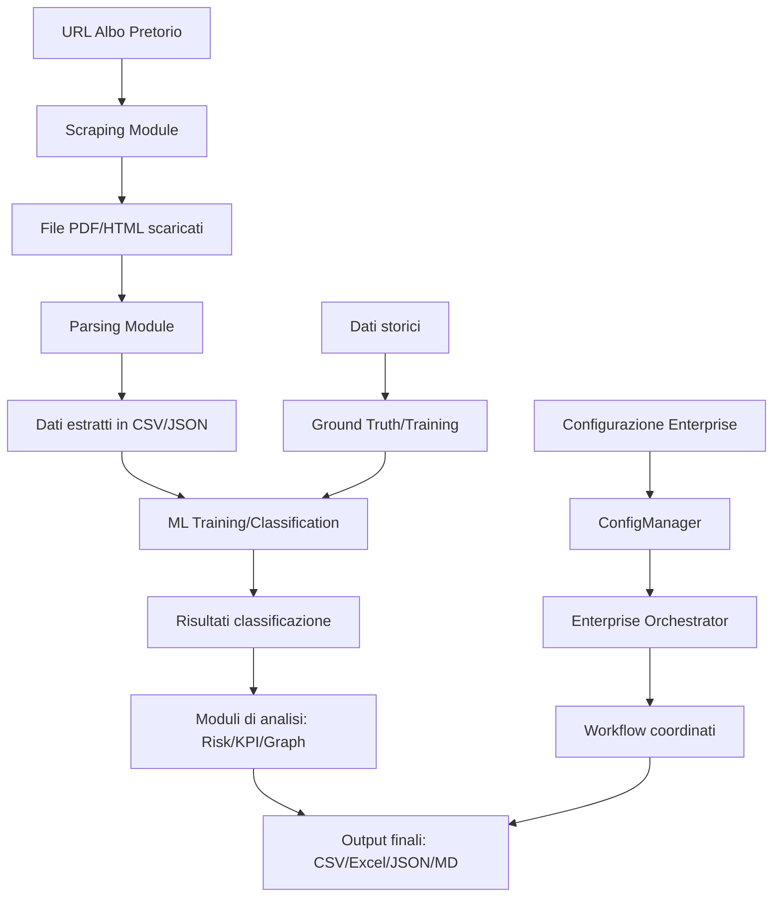

# Mappa I/O del Sistema

## Panoramica

Questa documentazione funge da "cartina tornasole" per comprendere i flussi di input/output del sistema, dalla ricezione dei dati grezzi fino alla generazione degli output finali.

> Tutti i percorsi menzionati in questo documento sono relativi alla directory principale del progetto.

## Input Principali

### Dati Esterni
- **URL Web**: Endpoint degli albi pretori comunali (configurabili tramite [config.py](file:///c:/Users\39329\albo-pretorio-audit-delivery/src/delibere_comunali/utils/config.py))
- **File PDF**: Documenti scaricati dagli albi pretori
- **File HTML**: Documenti in formato HTML (supportati per estrazione metadati)
- **File .p7m**: Documenti firmati digitalmente (con supporto per decrittografia)

### Configurazione
- **File .env**: Variabili d'ambiente (chiavi API, parametri di configurazione)
- **Parametri CLI**: Argomenti passati tramite linea di comando
- **File di configurazione JSON**: File di configurazione enterprise generati da [config_manager.py](file:///c:/Users\39329\albo-pretorio-audit-delivery/src/delibere_comunali/core/config_manager.py)

### Dati Storici
- **Training Data**: Dati storici per il training dei modelli ML
- **Ground Truth**: Etichette vere per la validazione dei modelli

## Output Principali

### Formato CSV
- **atti_parsed.csv**: Dati estratti dai documenti (posizionato in `data/{ente}/albo_download/`)
- **atti_audited.csv**: Risultati dell'audit
- **risk_assessment.csv**: Risultati della valutazione del rischio
- **top_importi.csv**: Importi più significativi
- **documenti_features.csv**: Feature estratte dai documenti
- **quality_issues.csv**: Problemi di qualità identificati

### Formato JSON
- **documenti_corpus.jsonl**: Corpus per il sistema RAG
- **procedures.json**: Processi digitali identificati
- **anomalies.json**: Anomalie rilevate
- **quality_metrics.json**: Metriche di qualità
- **albo_linked_data.jsonld**: Dati collegati semanticamente
- **coordinated_analysis_results.json**: Risultati dell'analisi coordinata (posizionato in `data/{ente}/albo_download/report/`)

### Formato Excel
- **albo_analisi.xlsx**: Report strutturato con analisi
- **albo_exploration.xlsx**: Esplorazione dei dati
- **kpi_dashboard.xlsx**: Dashboard dei KPI

### Formato Markdown
- **alert_antifrode.md**: Alert per possibili frodi
- **report.md**: Report generale
- **critical_points_analysis.md**: Analisi dei punti critici

### Formato HTML
- **knowledge_graph.html**: Visualizzazione del knowledge graph
- **dashboard.html**: Dashboard di controllo

### Formato GEXF
- **knowledge_graph.gexf**: Grafo per visualizzazione esterna

### Formato TXT
- **topological_insights.txt**: Insight topologici
- **procedural_insights.txt**: Insight procedurali

## Flusso degli Input/Output

## Percorsi Standard

### Dati di Input
- `data/{ente}/albo_download/` - File scaricati e dati grezzi
- `data/{ente}/albo_download/albo_metadati.csv` - Metadati dei documenti
- `data/{ente}/albo_download/allegati_parsed.csv` - Allegati analizzati

### Dati di Output
- `data/{ente}/albo_download/documenti_features.csv` - Feature estratte
- `data/{ente}/albo_download/documenti_corpus.jsonl` - Corpus RAG
- `data/{ente}/albo_download/procedures.json` - Processi digitali
- `data/{ente}/albo_download/anomalies.json` - Anomalie
- `data/{ente}/albo_download/albo_analisi.xlsx` - Report Excel
- `data/{ente}/albo_download/alert_antifrode.md` - Alert frode
- `data/{ente}/albo_download/report/` - Cartella per report dettagliati
- `data/{ente}/albo_download/report/risk_assessment.csv` - Report rischi
- `data/{ente}/albo_download/topological_insights.txt` - Insight topologici
- `data/{ente}/albo_download/config/` - Configurazioni enterprise
- `data/{ente}/albo_download/config/enterprise_config.json` - Configurazione enterprise

### Modelli ML
- `data/{ente}/random_forest_model.joblib` - Modello ML (secondo [模型资产路径管理规范](file:///ENTERPRISE_PARAMETERIZATION_GUIDE.md#L4-L12))

### Indici FAISS
- `data/{ente}/albo_download/faiss_index/` - Indici FAISS per RAG

## Interazioni tra Moduli

### Core Components
- [orchestrator.py](file:///c:/Users\39329\albo-pretorio-audit-delivery/src/delibere_comunali/core/orchestrator.py) coordina i moduli di analisi avanzata
- [data_coordinator.py](file:///c:/Users\39329\albo-pretorio-audit-delivery/src/delibere_comunali/core/data_coordinator.py) gestisce i dati condivisi
- [config_manager.py](file:///c:/Users\39329\albo-pretorio-audit-delivery/src/delibere_comunali/core/config_manager.py) gestisce la configurazione enterprise
- [enterprise_orchestration.py](file:///c:/Users\39329\albo-pretorio-audit-delivery/src/delibere_comunali/core/enterprise_orchestration.py) esegue i workflow enterprise

### Pipeline Components
- [run_pipeline.py](file:///c:/Users\39329\albo-pretorio-audit-delivery/src/delibere_comunali/cli/run_pipeline.py) orchestra l'intera pipeline
- [analyze_albo.py](file:///c:/Users\39329\albo-pretorio-audit-delivery/src/delibere_comunali/parsing/analyze_albo.py) analizza i documenti
- [train_model.py](file:///c:/Users\39329\albo-pretorio-audit-delivery/scripts/train_model.py) addestra i modelli ML

## Sicurezza e Governance

Tutti i dati di input/output rispettano i principi di governance pubblica:
- Solo documenti ufficiali pubblici vengono analizzati
- Nessun trattamento di dati sensibili
- Tutte le operazioni sono tracciate e verificabili
- I dati sono conservati in modo sicuro e conforme