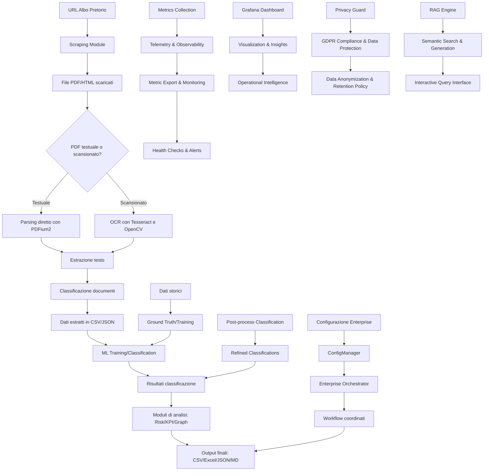
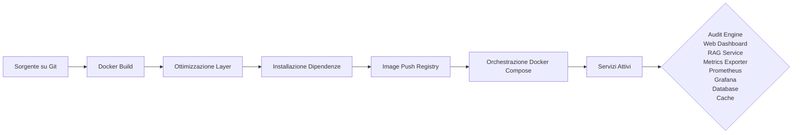
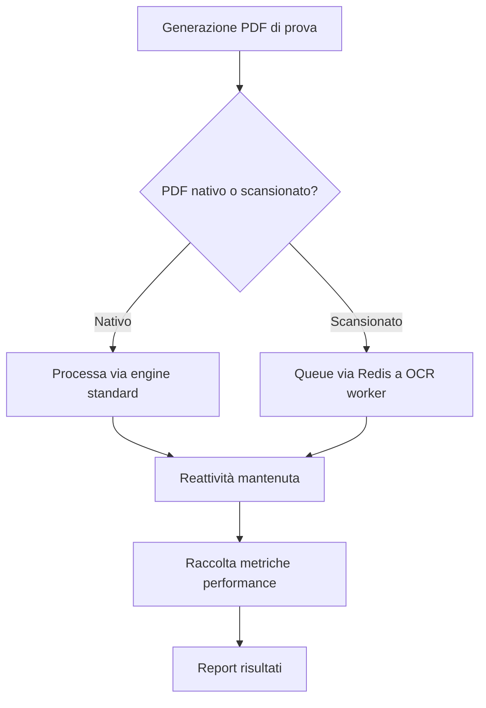
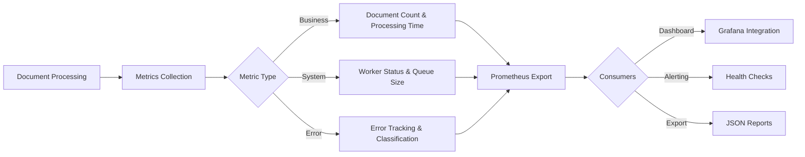
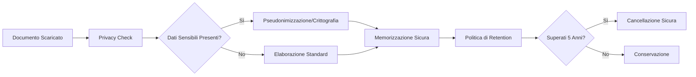
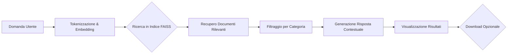
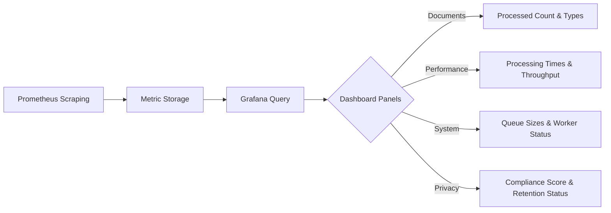

# Mappa I/O del Sistema

## Panoramica

Questa documentazione funge da "cartina tornasole" per comprendere i flussi di input/output del sistema, dalla ricezione dei dati grezzi fino alla generazione degli output finali.

> Tutti i percorsi menzionati in questo documento sono relativi alla directory principale del progetto.

## Input Principali

### Dati Esterni
- **URL Web**: Endpoint degli albi pretori comunali (configurabili tramite [config.py](src/delibere_comunali/utils/config.py))
- **File PDF**: Documenti scaricati dagli albi pretori (testuali e scansionati)
- **File HTML**: Documenti in formato HTML (supportati per estrazione metadati)
- **File .p7m**: Documenti firmati digitalmente (con supporto per decrittografia)

### Configurazione
- **File .env**: Variabili d'ambiente (chiavi API, parametri di configurazione)
- **Parametri CLI**: Argomenti passati tramite linea di comando
- **File di configurazione JSON**: File di configurazione enterprise generati da [config_manager.py](src/delibere_comunali/core/config_manager.py)

### Dati Storici
- **Training Data**: Dati storici per il training dei modelli ML
- **Ground Truth**: Etichette vere per la validazione dei modelli

## Output Principali

### Formato CSV
- **atti_parsed.csv**: Dati estratti dai documenti (posizionato in `data/{ente}/albo_download/`)
- **atti_audited.csv**: Risultati dell'audit
- **risk_assessment.csv**: Risultati della valutazione del rischio
- **top_importi.csv**: Importi più significativi
- **documenti_features.csv**: Feature estratte dai documenti
- **quality_issues.csv**: Problemi di qualità identificati

### Formato JSON
- **documenti_corpus.jsonl**: Corpus per il sistema RAG
- **procedures.json**: Processi digitali identificati
- **anomalies.json**: Anomalie rilevate
- **quality_metrics.json**: Metriche di qualità
- **albo_linked_data.jsonld**: Dati collegati semanticamente
- **coordinated_analysis_results.json**: Risultati dell'analisi coordinata (posizionato in `data/{ente}/albo_download/report/`)
- **metrics_export.json**: Esportazione completa delle metriche di sistema (posizionato in `data/metrics_export_YYYYMMDD_HHMMSS.json`)
- **privacy_compliance.json**: Report di conformità GDPR e protezione dati (posizionato in `data/{ente}/reports/privacy_compliance.json`)

### Formato Excel
- **albo_analisi.xlsx**: Report strutturato con analisi
- **albo_exploration.xlsx**: Esplorazione dei dati
- **kpi_dashboard.xlsx**: Dashboard dei KPI

### Formato Markdown
- **alert_antifrode.md**: Alert per possibili frodi
- **report.md**: Report generale
- **critical_points_analysis.md**: Analisi dei punti critici

### Formato HTML
- **knowledge_graph.html**: Visualizzazione del knowledge graph
- **dashboard.html**: Dashboard di controllo

### Formato GEXF
- **knowledge_graph.gexf**: Grafo per visualizzazione esterna

### Formato TXT
- **topological_insights.txt**: Insight topologici
- **procedural_insights.txt**: Insight procedurali

## Flusso degli Input/Output

## Percorsi Standard

### Dati di Input
- `data/{ente}/albo_download/` - File scaricati e dati grezzi
- `data/{ente}/albo_download/albo_metadati.csv` - Metadati dei documenti
- `data/{ente}/albo_download/allegati_parsed.csv` - Allegati analizzati

### Dati di Output
- `data/{ente}/albo_download/documenti_features.csv` - Feature estratte
- `data/{ente}/albo_download/documenti_corpus.jsonl` - Corpus RAG
- `data/{ente}/albo_download/procedures.json` - Processi digitali
- `data/{ente}/albo_download/anomalies.json` - Anomalie
- `data/{ente}/albo_download/albo_analisi.xlsx` - Report Excel
- `data/{ente}/albo_download/alert_antifrode.md` - Alert frode
- `data/{ente}/albo_download/report/` - Cartella per report dettagliati
- `data/{ente}/albo_download/report/risk_assessment.csv` - Report rischi
- `data/{ente}/albo_download/topological_insights.txt` - Insight topologici
- `data/{ente}/albo_download/config/` - Configurazioni enterprise
- `data/{ente}/albo_download/config/enterprise_config.json` - Configurazione enterprise
- `data/{ente}/reports/` - Cartella per report di conformità e privacy
- `data/{ente}/albo_download/faiss_index/` - Indice FAISS per ricerca semantica

### Modelli ML
- `data/{ente}/random_forest_model.joblib` - Modello ML (secondo le Specifiche di gestione percorsi dei modelli)

### Indici FAISS
- `data/{ente}/albo_download/faiss_index/` - Indici FAISS per RAG

### Metriche di Sistema
- `data/metrics_export_YYYYMMDD_HHMMSS.json` - Esportazione completa delle metriche
- `prometheus_metrics` - Metriche in formato Prometheus esposte sulla porta 8001

## Interazioni tra Moduli

### Core Components
- [orchestrator.py](file:///c:/Users\39329\albo-pretorio-audit-delivery/src/delibere_comunali/core/orchestrator.py) coordina i moduli di analisi avanzata
- [data_coordinator.py](file:///c:/Users\39329\albo-pretorio-audit-delivery/src/delibere_comunali/core/data_coordinator.py) gestisce i dati condivisi
- [config_manager.py](file:///c:/Users\39329\albo-pretorio-audit-delivery/src/delibere_comunali/core/config_manager.py) gestisce la configurazione enterprise
- [enterprise_orchestration.py](file:///c:/Users\39329\albo-pretorio-audit-delivery/src/delibere_comunali/core/enterprise_orchestration.py) esegue i workflow enterprise

### Pipeline Components
- [run_pipeline.py](file:///c:/Users\39329\albo-pretorio-audit-delivery/src/delibere_comunali/cli/run_pipeline.py) orchestra l'intera pipeline
- [analyze_albo.py](file:///c:/Users\39329\albo-pretorio-audit-delivery/src/delibere_comunali/parsing/analyze_albo.py) analizza i documenti
- [train_model.py](file:///c:/Users\39329\albo-pretorio-audit-delivery/scripts/train_model.py) addestra i modelli ML
- [ocr_processor.py](file:///c:/Users/39329\albo-pretorio-audit-delivery/src/delibere_comunali/parsing/ocr_processor.py) gestisce l'elaborazione OCR
- [post_process_classification.py](file:///c:/Users/39329\albo-pretorio-audit-delivery/src/delibere_comunali/parsing/post_process_classification.py) applica classificazioni post-elaborazione

### Osservabilità e Telemetria
- [metrics_collector.py](file:///c:/Users\39329\albo-pretorio-audit-delivery/src/delibere_comunali/utils/metrics_collector.py) raccolta metriche di sistema e business
- [metrics_exporter.py](file:///c:/Users\39329\albo-pretorio-audit-delivery/src/delibere_comunali/web/metrics_exporter.py) esporta metriche e fornisce API di monitoraggio
- **Porta 8001**: Endpoint Prometheus per metriche di sistema
- **Porta 8002**: API REST per esportazione metriche e health check

### Privacy e Conformità GDPR
- [privacy_guard.py](file:///c:/Users\39329\albo-pretorio-audit-delivery/src/delibere_comunali/utils/privacy_guard.py) implementa misure di protezione dei dati e conformità GDPR
- **Pseudonimizzazione**: Campo codice fiscale, partita IVA, email sostituiti con identificatori sicuri
- **Anonimizzazione**: Dati sensibili nei DataFrame resi anonimi mantenendo utilità analitica
- **Politica di retention**: Documenti cancellati automaticamente dopo 5 anni (1825 giorni)
- **Diritto all'oblio**: Implementazione dell'articolo 17 del GDPR per cancellazione dati su richiesta

### RAG (Retrieval Augmented Generation)
- [semantic_rag_engine.py](file:///c:/Users\39329\albo-pretorio-audit-delivery/src/delibere_comunali/rag/semantic_rag_engine.py) motore semantico per ricerca e generazione basata su documenti
- [rag_app.py](file:///c:/Users\39329\albo-pretorio-audit-delivery/src/delibere_comunali/rag/rag_app.py) interfaccia Streamlit per interazione semantica
- **Indice FAISS**: Ricerca semantica veloce su documenti processati
- **Embedding multilingua**: Supporto per documenti in italiano con modelli multilingua
- **Filtri categoria**: Possibilità di filtrare risultati per tipo di documento (deliberazioni, determinazioni, ecc.)
- **Generazione risposte**: Sistema di generazione risposte basato sul contesto fornito dai documenti

## Deployment e Containerizzazione

### Docker
- **Dockerfile**: Configurazione per containerizzazione del sistema
- **Immagini**: Ottimizzate per dimensioni ridotte (<800MB) grazie a uso di `python:slim` e pulizia dei layer
- **Volume Mounting**: Supporto per montaggio volumi per persistenza dati in `data/`
- **Port Exposure**: Porta 8501 esposta per dashboard Streamlit, 8000 per RAG service, 8001 per Prometheus, 8002 per API metriche
- **Sicurezza**: Esecuzione come utente non-root per sicurezza

### Docker Compose
- **docker-compose.yml**: Configurazione per orchestrazione completa dell'ecosistema
- **Servizi**: audit-engine, web-dashboard, rag-service, postgres, redis, ocr-worker, metrics-exporter, prometheus, grafana
- **Networking**: Isolamento di rete con bridge dedicato
- **Health Checks**: Verifica della disponibilità dei servizi
- **Persistence**: Volumi dedicati per dati critici (database, log, dati di input/output)
- **Scaling**: Supporto per scaling dei servizi tramite `docker-compose scale`

### Flusso di Deployment

## Test e Validazione

### Simulazione End-to-End
- **e2e_simulation.py**: Script per testare il bilanciamento del carico tra engine standard e OCR workers
- **Mock PDF Generator**: Generazione automatica di PDF nativi e scansionati per test
- **Load Balancing Test**: Simulazione del routing intelligente verso OCR workers via Redis
- **Performance Metrics**: Monitoraggio di tempi di elaborazione, errori e utilizzo risorse
- **Validation Criteria**: Tutti i PDF scansionati devono essere elaborati via OCR, i nativi via engine standard

### Flusso di Test

## Osservabilità e Telemetria

### Metriche di Sistema e Business
- **[metrics_collector.py](file:///c:/Users\39329\albo-pretorio-audit-delivery/src/delibere_comunali/utils/metrics_collector.py)**: Raccolta centralizzata di metriche di sistema e business
- **Metriche Business**: Numero di documenti elaborati, tempi di processing, metodi di elaborazione (OCR vs standard)
- **Metriche Sistema**: Stato dei worker, dimensione code Redis, errori rilevati
- **Prometheus Integration**: Esposizione metriche su porta 8001 in formato Prometheus
- **Storico Locale**: Memorizzazione delle ultime 1000 metriche per analisi offline

### API di Monitoraggio
- **[metrics_exporter.py](file:///c:/Users\39329\albo-pretorio-audit-delivery/src/delibere_comunali/web/metrics_exporter.py)**: API REST per accesso alle metriche
- **Endpoint /health**: Stato di salute complessivo del sistema
- **Endpoint /metrics/documents**: Metriche di elaborazione documenti
- **Endpoint /metrics/errors**: Metriche di errore e qualità
- **Endpoint /metrics/export**: Esportazione completa delle metriche in JSON

### Flusso di Osservabilità

## Privacy e Conformità GDPR

### Misure di Protezione Dati
- **privacy_guard.py**: Implementazione di misure di protezione dei dati e conformità GDPR
- **Pseudonimizzazione**: Sostituzione di dati sensibili (codice fiscale, partita IVA, email) con identificatori sicuri
- **Anonimizzazione**: Rimozione di dati personali dai DataFrame mentre si mantiene l'utilità analitica
- **Crittografia**: Campi sensibili nei documenti crittografati quando memorizzati
- **Politica di retention**: Eliminazione automatica dei dati dopo 5 anni (1825 giorni) come richiesto per documenti amministrativi

### Diritti dell'Interessato
- **Diritto all'oblio**: Implementazione dell'articolo 17 del GDPR tramite comando CLI `python run.py gdpr-delete`
- **Diritto di accesso**: Tutti i dati personali sono accessibili tramite report di conformità
- **Diritto di rettifica**: Meccanismi per correggere dati errati attraverso feedback operatori
- **Diritto alla portabilità**: Dati esportabili in formato strutturato (JSON, CSV)

### Flusso di Conformità

## RAG e Interazione Semantica

### Motore di Ricerca Semantica
- **[semantic_rag_engine.py](file:///c:/Users\39329\albo-pretorio-audit-delivery/src/delibere_comunali/rag/semantic_rag_engine.py)**: Sistema avanzato di ricerca semantica basato su FAISS e modelli di embedding
- **Indice FAISS**: Ricerca veloce in spazio vettoriale per similarità semantica
- **Embedding multilingua**: Supporto per documenti in italiano con modelli specializzati
- **Filtri categoria**: Possibilità di filtrare risultati per tipo di documento
- **Generazione contestuale**: Risposte basate sul contenuto specifico dei documenti recuperati

### Interfaccia Utente
- **[rag_app.py](file:///c:/Users\39329\albo-pretorio-audit-delivery/src/delibere_comunali/rag/rag_app.py)**: Interfaccia Streamlit per interazione semantica con i documenti
- **Query naturale**: Possibilità di porre domande in linguaggio naturale
- **Visualizzazione risultati**: Mostra documenti rilevanti con punteggi di similarità
- **Esportazione risultati**: Download dei risultati in formato CSV
- **Statistiche RAG**: Informazioni sull'indice e sui documenti disponibili

### Flusso di Interazione

## Visualizzazione e Monitoraggio

### Grafana Dashboard
- **[grafana/dashboards/system_metrics.json](file:///c:/Users\39329\albo-pretorio-audit-delivery/grafana/dashboards/system_metrics.json)**: Dashboard preconfigurata per la visualizzazione delle metriche di sistema
- **Panelli inclusi**: Processamento documenti, tempi di elaborazione, dimensione code Redis, stato worker, tassi di errore, throughput
- **Auto-provisioning**: Dashboard disponibile immediatamente dopo il `docker-compose up`
- **Template variabili**: Supporto per filtri per ente e periodo temporale

### Prometheus
- **[prometheus/prometheus.yml](file:///c:/Users\39329\albo-pretorio-audit-delivery/prometheus/prometheus.yml)**: Configurazione per lo scraping delle metriche
- **Target**: audit-engine (porta 8001), metrics-exporter (porta 8001)
- **Intervallo scraping**: 5 secondi per metriche in tempo reale
- **Retention**: 200 ore di dati storici

### Flusso di Visualizzazione

## Sicurezza e Governance

Tutti i dati di input/output rispettano i principi di governance pubblica:
- Solo documenti ufficiali pubblici vengono analizzati
- Nessun trattamento di dati sensibili senza pseudonimizzazione/cripttografia
- Tutte le operazioni sono tracciate e verificabili
- I dati sono conservati in modo sicuro e conforme
- Implementazione del diritto all'oblio come richiesto dal GDPR