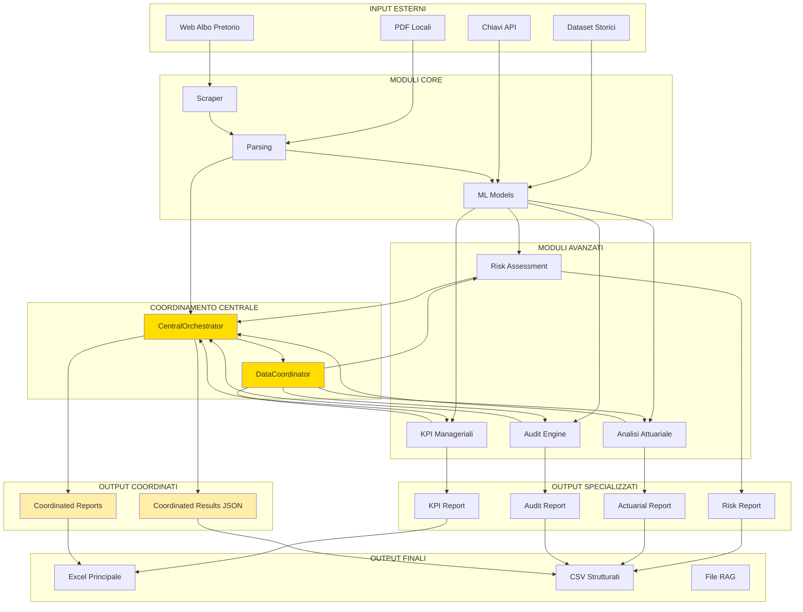

# Mappa di Input/Output del Sistema di Audit dell'Albo Pretorio

## Panoramica

Documento che mappa tutti i flussi di input/output del sistema, inclusi i nuovi flussi introdotti dal modulo di coordinamento centrale.

## Input Principali

### Fonti Esterne
- **Web Albo Pretorio**: URL pubbliche degli albi pretori comunali
- **File PDF Locali**: Documenti scaricati precedentemente
- **Dataset Storici**: Dati di training e validazione precedenti
- **Chiavi API**: Google API Key per LLM

### Parametri di Configurazione
- **ENTE**: Nome dell'ente comunale da analizzare
- **Opzioni Pipeline**: --skip-scrape, --use-llm, --force, --strict-validation
- **Parametri ML**: Opzioni per l'addestramento e la predizione

## Output Principali

### File Strutturati
- **atti_parsed.csv**: Dati estratti dagli atti
- **documenti_features.csv**: Features per ML
- **documenti_corpus.jsonl**: Corpus per RAG
- **procedures.json**: Struttura del digital twin
- **anomalies.json**: Anomalie rilevate

### Report Specializzati
- **risk_assessment.csv**: Risultati della valutazione del rischio
- **kpi_dashboard.xlsx**: KPI manageriali
- **provisioning_attuariale.xlsx**: Analisi attuariale
- **atti_audited.csv**: Risultati dell'audit
- **albo_analisi.xlsx**: Report principale

### Output del Coordinamento
- **coordinated_analysis_results.json**: Risultati coordinati tra tutti i moduli
- **risk_assessment_coordinated.csv**: Versione coordinata del risk assessment
- **kpi_manageriali_coordinated.csv**: Versione coordinata dei KPI

## Flusso degli Input/Output



## Schema dei Dati Condivisi

### Struttura dati coordinati
```
coordinated_analysis_results.json:
{
  "timestamp": "ISO datetime",
  "risk_results": {
    "risk_by_document": [...],
    "summary_statistics": {...}
  },
  "kpi_results": {
    "efficienza": {...},
    "efficacia": {...},
    "economicita": {...},
    "trasparenza": {...}
  },
  "ml_results": {...},
  "audit_results": {...}
}
```

## Consumatori dei Dati

### Moduli Interni
- **Control Room**: Utilizza tutti i report per la dashboard
- **RAG System**: Usa i dati coordinati per migliorare le risposte
- **ML Models**: Riceve feedback dai risultati coordinati

### Utenti Finali
- **Operatori Umani**: Utilizzano i report per la validazione
- **Analisti**: Studiano i risultati coordinati per insight
- **Autorità di Controllo**: Ricevono report integrati

## Frequenza di Aggiornamento

- **Input**: Giornaliero per scraping, mensile per dataset storici
- **Output Intermedi**: Ogni esecuzione della pipeline
- **Output Coordinati**: Ogni esecuzione dell'orchestrator
- **Report Finali**: Alla conclusione della pipeline completa