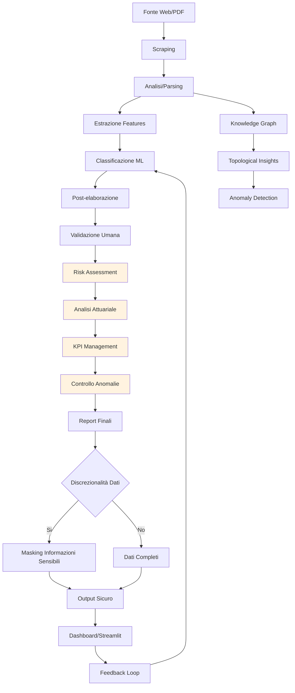

# Mappa Input/Output del Sistema di Audit dell'Albo Pretorio

Questa mappa funge da "cartina tornasole" per comprendere i flussi di dati nel sistema e garantire una visione chiara dell'architettura complessiva.

## Input Principali

### 1. Dati Esterni
- **Fonte Web**: Documenti PDF dell'albo pretorio comunale (tramite scraping)
- **File PDF Locali**: Documenti scaricati precedentemente
- **File CSV di Input**: Dati grezzi da analizzare (allegati_parsed.csv, albo_metadati.csv)

### 2. Parametri di Configurazione
- **Parametri CLI**: Opzioni passate da linea di comando (`--ente`, `--use-llm`, ecc.)
- **File di Configurazione**: `.env` per chiavi API e configurazioni esterne
- **Parametri di Modello**: Iperparametri per i modelli ML

### 3. Dati Storici
- **File di Training**: Dati etichettati per addestramento modelli
- **Feedback Umano**: File Excel con revisioni umane (`feedback_operatore.csv`)
- **Storico Analisi**: Risultati precedenti per benchmark

## Output Principali

### 1. Risultati di Classificazione
- **allegati_parsed.csv**: Dati estratti e classificati
- **documenti_features.csv**: Features estratte per ML
- **atti_audited.csv**: Documenti con annotazioni di audit

### 2. Modelli e Analisi
- **modelli_salvati/**: Modelli ML serializzati
- **risk_assessment.csv**: Valutazioni di rischio per ogni documento
- **provisioning_attuariale.xlsx**: Analisi attuariale degli impegni
- **kpi_dashboard.xlsx**: Indicatori di governance e controllo

### 3. Report e Dashboard
- **report/**: Cartella contenente tutti i report generati
- **knowledge_graph.html**: Visualizzazione del grafo delle relazioni
- **topological_insights.txt**: Analisi topologica delle concentrazioni
- **quality_metrics.json**: Metriche di qualità del processo

### 4. File Intermedi
- **documenti_corpus.jsonl**: Corpus per RAG
- **procedures.json**: Procedure strutturate
- **anomalies.json**: Anomalie rilevate
- **cache/**: Cache temporanea per ottimizzare le esecuzioni

## Flusso degli Input/Output

## Discrezionalità dei Dati

Il sistema implementa meccanismi per garantire la protezione delle informazioni sensibili:

1. **Mascheramento**: Nasconde dati personali identificabili
2. **Aggregazione**: Fornisce dati aggregati anziché individuali quando possibile
3. **Controllo Accessi**: Diversi livelli di accesso ai dati
4. **Conformità GDPR**: Rispetta le normative sulla privacy

## Tracciabilità e Manutenzione

Ogni componente del sistema è documentato per facilitare:
- **Debug**: Identificazione rapida dei problemi
- **Estensione**: Aggiunta di nuove funzionalità
- **Manutenzione**: Aggiornamenti e correzioni
- **Audit**: Revisione delle decisioni del sistema

## Note per la Manutenzione Futura

1. **Versionamento**: Ogni output deve includere informazioni sulla versione del sistema
2. **Log**: Tutti i processi devono essere tracciati con log dettagliati
3. **Monitoraggio**: Ipercubo delle metriche di qualità
4. **Documentazione**: Aggiornamento costante della documentazione tecnica