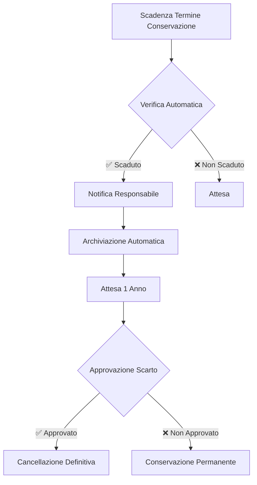

# Piano di Conservazione dei Documenti - Albo Pretorio Audit Delivery

**Versione:** 1.0  
**Data:** 10/07/2026  
**Approvato con:** Delibera di Giunta n. [XXX]/2026  
**Responsabile:** [Nome Responsabile Trasparenza]  

---

## 📜 **1. Premessa e Riferimenti Normativi**

### **1.1 Oggetto del Piano**
Il presente **Piano di Conservazione** disciplina i **termini, le modalità e le responsabilità** relative alla conservazione dei documenti trattati dal sistema **Albo Pretorio Audit Delivery**, in conformità al **D.Lgs. 33/2013** (Trasparenza Amministrativa) e alle **Linee Guida ANAC**.

### **1.2 Riferimenti Normativi**

| Normativa | Articolo | Descrizione |
|-----------|----------|-------------|
| **D.Lgs. 33/2013** | Art. 8 | Obbligo di conservazione dei documenti |
| **D.Lgs. 33/2013** | Art. 22 | Pubblicazione atti amministrativi |
| **D.Lgs. 33/2013** | Art. 29 | Pubblicazione dati contabili |
| **D.Lgs. 50/2016** | Art. 29 | Pubblicazione bandi e contratti |
| **CAD (D.Lgs. 82/2005)** | Art. 44 | Conservazione digitale dei documenti |
| **Linee Guida ANAC** | - | Conservazione e scarto dei documenti |

---

## 📁 **2. Classificazione dei Documenti**

### **2.1 Tipologie di Documenti**
I documenti sono classificati in **3 macro-categorie** in base al **termine di conservazione**:

| **Macro-Categoria** | **Termine di Conservazione** | **Normativa** |
|--------------------|-----------------------------|---------------|
| **A - Documenti Amministrativi** | 5 anni | D.Lgs. 33/2013 Art. 22 |
| **B - Documenti Contabili** | 10 anni | D.Lgs. 33/2013 Art. 29 |
| **C - Documenti di Gara** | 2-5 anni | D.Lgs. 50/2016 |

---

## 🗂️ **3. Tabella di Conservazione Dettagliata**

### **3.1 Documenti Amministrativi (5 anni)**

| **Tipologia** | **Descrizione** | **Termine Conservazione** | **Normativa** | **Formato** | **Note** |
|--------------|----------------|---------------------------|---------------|-------------|----------|
| **Delibere di Giunta** | Atti deliberativi della Giunta Comunale | 5 anni | D.Lgs. 33/2013 Art. 22 | PDF, XML | Conservare anche allegati |
| **Delibere di Consiglio** | Atti deliberativi del Consiglio Comunale | 5 anni | D.Lgs. 33/2013 Art. 22 | PDF, XML | Conservare anche allegati |
| **Determinazioni Dirigenziali** | Atti dirigenziali | 5 anni | D.Lgs. 33/2013 Art. 22 | PDF, XML | Conservare anche allegati |
| **Atti di Programmazione** | Piani, programmi, relazioni | 5 anni | D.Lgs. 33/2013 Art. 10 | PDF, XML | - |
| **Regolamenti** | Regolamenti comunali | 5 anni | D.Lgs. 33/2013 Art. 20 | PDF, XML | Conservare versioni storiche |
| **Verbali** | Verbali di sedute | 5 anni | D.Lgs. 33/2013 Art. 22 | PDF, XML | - |
| **Avvisi Pubblici** | Avvisi, bandi, manifestazioni di interesse | 5 anni | D.Lgs. 33/2013 Art. 22 | PDF, XML | - |

### **3.2 Documenti Contabili (10 anni)**

| **Tipologia** | **Descrizione** | **Termine Conservazione** | **Normativa** | **Formato** | **Note** |
|--------------|----------------|---------------------------|---------------|-------------|----------|
| **Impegni di Spesa** | Atti di impegno contabile | 10 anni | D.Lgs. 33/2013 Art. 29 | PDF, XML | Conservare anche allegati |
| **Liquidazioni** | Atti di liquidazione | 10 anni | D.Lgs. 33/2013 Art. 29 | PDF, XML | Conservare anche allegati |
| **Mandati di Pagamento** | Ordini di pagamento | 10 anni | D.Lgs. 33/2013 Art. 29 | PDF, XML | - |
| **Certificati di Pagamento** | Certificati contabili | 10 anni | D.Lgs. 33/2013 Art. 29 | PDF, XML | - |
| **Bilanci** | Bilancio preventivo e consuntivo | 10 anni | D.Lgs. 33/2013 Art. 29 | PDF, XML | Conservare allegati |
| **Rendiconti** | Rendiconto di gestione | 10 anni | D.Lgs. 33/2013 Art. 29 | PDF, XML | - |
| **Atti di Accertamento** | Accertamenti tributari | 10 anni | D.Lgs. 33/2013 Art. 29 | PDF, XML | - |

### **3.3 Documenti di Gara (2-5 anni)**

| **Tipologia** | **Descrizione** | **Termine Conservazione** | **Normativa** | **Formato** | **Note** |
|--------------|----------------|---------------------------|---------------|-------------|----------|
| **Bandi di Gara** | Bandi e avvisi di gara | 2 anni | D.Lgs. 50/2016 Art. 29 | PDF, XML | Conservare anche allegati |
| **Disciplinari di Gara** | Documentazione di gara | 5 anni | D.Lgs. 50/2016 Art. 37 | PDF, XML | - |
| **Aggiudicazioni** | Atti di aggiudicazione | 5 anni | D.Lgs. 50/2016 Art. 37 | PDF, XML | Conservare anche allegati |
| **Contratti** | Contratti pubblici | 5 anni | D.Lgs. 50/2016 Art. 37 | PDF, XML | Conservare anche allegati |
| **Verbali di Gara** | Verbali delle commissioni | 5 anni | D.Lgs. 50/2016 Art. 37 | PDF, XML | - |

---

## 🗓️ **4. Calendario di Conservazione**

### **4.1 Scadenze Automatiche**
Il sistema **automatizza** la gestione delle scadenze secondo il seguente calendario:

| **Azione** | **Frequenza** | **Responsabile** | **Modalità** |
|------------|---------------|------------------|--------------|
| **Verifica Scadenze** | Giornaliera | Sistema Automatico | Controllo automatico |
| **Notifica Scadenza** | 30 giorni prima | Responsabile Trasparenza | Email automatica |
| **Archiviazione** | Al termine del periodo | Sistema Automatico | Spostamento in archivio |
| **Cancellazione** | Dopo 1 anno dall'archiviazione | Amministratore | Manuale (con approvazione) |

### **4.2 Procedure di Scarto**

---

## 💾 **5. Modalità di Conservazione**

### **5.1 Formati di Conservazione**

| **Formato** | **Descrizione** | **Utilizzo** | **Normativa** |
|-------------|----------------|--------------|---------------|
| **PDF/A** | Formato PDF per archiviazione a lungo termine | Documenti originali | ISO 19005 |
| **XML** | Formato strutturato per dati | Metadati e dati strutturati | W3C |
| **JSON** | Formato leggibile per macchine | Dati di analisi | RFC 8259 |
| **CSV** | Formato tabellare | Report e statistiche | RFC 4180 |
| **ZIP** | Formato compresso | Archivi | PKWARE |

### **5.2 Supporti di Conservazione**

| **Supporto** | **Descrizione** | **Utilizzo** | **Durata** |
|-------------|----------------|--------------|------------|
| **Server Locale** | Server dell'ente | Conservazione attiva | 5-10 anni |
| **Cloud Pubblico** | Servizio cloud certificato | Backup e ridondanza | 5-10 anni |
| **NAS** | Network Attached Storage | Archiviazione | 5-10 anni |
| **Nastro Magnetico** | Supporto offline | Archiviazione a lungo termine | 10+ anni |

### **5.3 Requisiti di Conservazione**

| **Requisito** | **Descrizione** | **Normativa** | **Implementazione** |
|---------------|----------------|---------------|---------------------|
| **Integrità** | I documenti non devono essere modificati | CAD Art. 44 | Hash SHA-256 |
| **Autenticità** | I documenti devono essere autentici | CAD Art. 24 | Firma digitale |
| **Leggibilità** | I documenti devono essere leggibili | CAD Art. 44 | Formati aperti |
| **Tracciabilità** | Tutte le operazioni devono essere tracciate | ISO 27001 | Audit trail |
| **Reperibilità** | I documenti devono essere facilmente reperibili | D.Lgs. 33/2013 | Indici e metadati |

---

## 🔄 **6. Procedure di Migrazione e Recupero**

### **6.1 Migrazione dei Dati**

| **Scenario** | **Procedura** | **Responsabile** | **Tempo Massimo** |
|--------------|---------------|------------------|-------------------|
| **Cambio Server** | 1. Backup completo 2. Migrazione dati 3. Verifica integrità | Amministratore | 24 ore |
| **Cambio Versione** | 1. Backup dati 2. Aggiornamento software 3. Test di compatibilità | Amministratore | 12 ore |
| **Cambio Formato** | 1. Conversione dati 2. Verifica integrità 3. Aggiornamento metadati | Amministratore | 48 ore |

### **6.2 Recupero dei Dati**

| **Scenario** | **Procedura** | **Responsabile** | **Tempo Massimo** |
|--------------|---------------|------------------|-------------------|
| **Ripristino da Backup** | 1. Identificazione backup 2. Ripristino dati 3. Verifica integrità | Amministratore | 4 ore |
| **Recupero da Archivio** | 1. Ricerca documento 2. Estrazione da archivio 3. Verifica integrità | Amministratore | 2 ore |
| **Recupero Dati Cancellati** | 1. Verifica possibilità 2. Recupero da backup 3. Ripristino | Amministratore | 24 ore |

---

## 🔒 **7. Sicurezza e Protezione dei Dati**

### **7.1 Misure di Sicurezza**

| **Misura** | **Descrizione** | **Normativa** | **Implementazione** |
|------------|----------------|---------------|---------------------|
| **Cifratura** | Cifratura TLS 1.3 per trasmissione | CAD Art. 50 | ✅ |
| **Backup** | Backup quotidiano su server remoto | CAD Art. 50 | ✅ |
| **Accesso Controllato** | Autenticazione forte (SPID/CIE) | CAD Art. 64 | ✅ |
| **Logging** | Tracciamento completo delle operazioni | ISO 27001 | ✅ |
| **Firewall** | Protezione perimetrale | CAD Art. 51 | ✅ |

### **7.2 Gestione degli Incidenti**

| **Tipo Incident** | **Procedura** | **Responsabile** | **Tempo Massimo** |
|------------------|---------------|------------------|-------------------|
| **Perdita Dati** | 1. Ripristino da backup 2. Verifica integrità 3. Notifica DPO | Amministratore | 4 ore |
| **Corruzione Dati** | 1. Identificazione causa 2. Ripristino da backup 3. Notifica | Amministratore | 8 ore |
| **Accesso Non Autorizzato** | 1. Blocco accesso 2. Verifica log 3. Notifica DPO | Amministratore | 1 ora |

---

## 📊 **8. Monitoraggio e Reporting**

### **8.1 Metriche di Monitoraggio**

| **Metrica** | **Descrizione** | **Frequenza** | **Responsabile** |
|-------------|----------------|---------------|------------------|
| **Documenti in Scadenza** | Numero di documenti in scadenza | Giornaliera | Sistema Automatico |
| **Documenti Archiviati** | Numero di documenti archiviati | Settimanale | Amministratore |
| **Documenti Cancellati** | Numero di documenti cancellati | Mensile | Amministratore |
| **Spazio Occupato** | Spazio su disco occupato | Giornaliera | Sistema Automatico |
| **Tempi di Recupero** | Tempo medio di recupero dati | Mensile | Amministratore |

### **8.2 Report Automatici**

| **Report** | **Frequenza** | **Destinatari** | **Formato** |
|------------|---------------|----------------|-------------|
| **Report Scadenze** | Giornaliera | Responsabile Trasparenza | Email, PDF |
| **Report Archiviazione** | Settimanale | Amministratore | Email, CSV |
| **Report Conservazione** | Mensile | DPO, Amministratore | PDF, CSV |
| **Report di Conformità** | Ogni 6 mesi | Sindaco, DPO | PDF |

---

## ⚖️ **9. Responsabilità e Sanzioni**

### **9.1 Responsabilità**

| **Ruolo** | **Responsabilità** | **Normativa** |
|-----------|-------------------|---------------|
| **Amministratore di Sistema** | Conservazione e integrità dei dati | CAD Art. 50 |
| **Responsabile Trasparenza** | Rispetto dei termini di pubblicazione | D.Lgs. 33/2013 |
| **DPO** | Conformità GDPR | GDPR Art. 37 |
| **Sindaco/Presidente** | Responsabilità finale | D.Lgs. 33/2013 |

### **9.2 Sanzioni**

| **Violazione** | **Sanzione** | **Normativa** |
|---------------|--------------|---------------|
| **Omissione di conservazione** | Sanzione amministrativa (€500-€5.000) | D.Lgs. 33/2013 Art. 43 |
| **Cancellazione anticipata** | Sanzione amministrativa (€1.000-€10.000) | D.Lgs. 33/2013 Art. 44 |
| **Violazione GDPR** | Sanzione fino a €20.000.000 o 4% fatturato | GDPR Art. 83 |

---

## 📞 **10. Contatti**

| **Ruolo** | **Nome** | **Email** | **Telefono** |
|-----------|----------|-----------|-------------|
| **Responsabile Trasparenza** | [Nome] | trasparenza@ente.it | +39 XXX XXXXXXX |
| **Amministratore di Sistema** | [Nome] | it@ente.it | +39 XXX XXXXXXX |
| **DPO** | [Nome] | dpo@ente.it | +39 XXX XXXXXXX |

---

## 📅 **11. Revisione e Aggiornamenti**

| **Versione** | **Data** | **Descrizione** | **Approvato da** |
|--------------|----------|----------------|------------------|
| 1.0 | 10/07/2026 | Versione iniziale | Giunta Comunale |
| | | | |

> **🔹 Nota:**
> *Questo piano deve essere **aggiornato** ogni 12 mesi o in caso di modifiche normative o del Sistema.*

---

## ✅ **Appendice A: Checklist di Conservazione**

- [ ] **Documenti Amministrativi**: Conservati per 5 anni
- [ ] **Documenti Contabili**: Conservati per 10 anni
- [ ] **Documenti di Gara**: Conservati per 2-5 anni
- [ ] **Backup**: Eseguito quotidianamente
- [ ] **Archiviazione**: Automatica al termine del periodo
- [ ] **Scarto**: Approvato dal Responsabile Trasparenza
- [ ] **Integrità**: Verificata con hash SHA-256
- [ ] **Report**: Generati automaticamente

---

## ✅ **Appendice B: Glossario**

| **Termine** | **Descrizione** |
|-------------|----------------|
| **Albo Pretorio** | Strumento di pubblicità legale degli atti amministrativi |
| **D.Lgs. 33/2013** | Normativa sulla trasparenza amministrativa |
| **CAD** | Codice dell'Amministrazione Digitale |
| **PDF/A** | Formato PDF per archiviazione a lungo termine |
| **Hash SHA-256** | Algoritmo di hash per verificare l'integrità dei dati |
| **DPO** | Data Protection Officer (Responsabile Protezione Dati) |
| **ANAC** | Autorità Nazionale Anticorruzione |

---

*Documento approvato con Delibera di Giunta n. [XXX]/2026*
*Ultimo aggiornamento: 10/07/2026*
