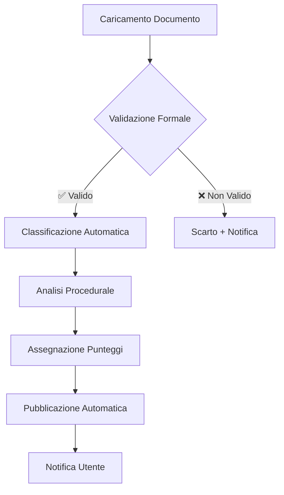

# Regolamento di Gestione del Sistema Albo Pretorio Audit Delivery

**Versione:** 1.0  
**Data:** 10/07/2026  
**Approvato con:** Delibera di Giunta n. [XXX]/2026  
**Responsabile:** [Nome Responsabile IT]  

---

## 📜 **1. Premessa e Ambito di Applicazione**

### **1.1 Oggetto del Regolamento**
Il presente regolamento disciplina **l'utilizzo, la gestione e la manutenzione** del sistema **Albo Pretorio Audit Delivery** (di seguito "Sistema"), sviluppato per **automatizzare l'analisi, la classificazione e il monitoraggio** dei documenti pubblicati nell'Albo Pretorio degli enti locali, ai sensi del **D.Lgs. 33/2013** (Trasparenza Amministrativa).

### **1.2 Ambito di Applicazione**
Il regolamento si applica a:
- **Tutti gli utenti** del Sistema (amministratori, operatori, utenti esterni)
- **Tutti i documenti** trattati dal Sistema (delibere, determinazioni, contratti, ecc.)
- **Tutte le operazioni** eseguite tramite il Sistema (analisi, classificazione, reporting)

### **1.3 Riferimenti Normativi**
| Normativa | Descrizione | Articoli Rilevanti |
|-----------|-------------|---------------------|
| **D.Lgs. 33/2013** | Trasparenza Amministrativa | Art. 1-54 |
| **D.Lgs. 82/2005 (CAD)** | Codice Amministrazione Digitale | Art. 1-75 |
| **D.Lgs. 267/2000 (TUEL)** | Testo Unico Enti Locali | Art. 1-276 |
| **GDPR (UE 2016/679)** | Protezione Dati Personali | Art. 2, 6, 9 |
| **D.Lgs. 50/2016** | Codice dei Contratti Pubblici | Art. 1-220 |

---

## 👥 **2. Ruoli e Responsabilità**

### **2.1 Ruoli del Sistema**

| Ruolo | Descrizione | Permessi | Responsabilità |
|-------|-------------|----------|-----------------|
| **Amministratore di Sistema** | Gestisce la configurazione e la manutenzione | ✅ Tutti | Garantire la disponibilità e la sicurezza del Sistema |
| **Responsabile Trasparenza** | Supervisiona la pubblicazione dei dati | ✅ Lettura, Scrittura, Report | Garantire la conformità al D.Lgs. 33/2013 |
| **Operatore Albo Pretorio** | Inserisce e gestisce i documenti | ✅ Lettura, Scrittura | Inserire e validare i documenti |
| **Utente Esterno** | Consulta i dati pubblici | ✅ Solo Lettura | Rispettare le condizioni d'uso |
| **DPO (Data Protection Officer)** | Monitora la conformità GDPR | ✅ Audit, Report | Garantire la conformità al GDPR |

### **2.2 Matrice dei Permessi**

| Azione | Amministratore | Responsabile Trasparenza | Operatore | Utente Esterno |
|--------|---------------|--------------------------|-----------|----------------|
| **Accesso al Sistema** | ✅ | ✅ | ✅ | ✅ |
| **Inserimento Documenti** | ✅ | ✅ | ✅ | ❌ |
| **Modifica Documenti** | ✅ | ✅ | ✅ | ❌ |
| **Cancellazione Documenti** | ✅ | ❌ | ❌ | ❌ |
| **Esecuzione Analisi** | ✅ | ✅ | ✅ | ❌ |
| **Generazione Report** | ✅ | ✅ | ✅ | ✅ (solo pubblici) |
| **Configurazione Sistema** | ✅ | ❌ | ❌ | ❌ |
| **Gestione Utenti** | ✅ | ❌ | ❌ | ❌ |
| **Audit e Logging** | ✅ | ✅ | ❌ | ❌ |

---

## 🔐 **3. Accesso e Autenticazione**

### **3.1 Modalità di Accesso**
Il Sistema supporta le seguenti modalità di autenticazione:

| Modalità | Descrizione | Livello di Sicurezza | Obbligatorio per |
|----------|-------------|---------------------|------------------|
| **SPID** | Sistema Pubblico di Identità Digitale | ⭐⭐⭐⭐⭐ | Tutti gli utenti |
| **CIE** | Carta di Identità Elettronica | ⭐⭐⭐⭐⭐ | Tutti gli utenti |
| **CNS** | Carta Nazionale dei Servizi | ⭐⭐⭐⭐ | Amministratori |
| **Credenziali Locali** | Username + Password | ⭐⭐ | Solo per ambienti di test |

### **3.2 Procedure di Accesso**

#### **3.2.1 Primo Accesso**
1. L'utente riceve le **credenziali temporanee** via email (solo per ambienti di test) o utilizza **SPID/CIE/CNS**
2. Al primo accesso, l'utente **deve:**
   - Accettare il **Regolamento di Gestione**
   - Accettare la **Privacy Policy**
   - Cambiare la password (se credenziali temporanee)

#### **3.2.2 Accesso Successivo**
1. L'utente accede tramite **SPID/CIE/CNS** o credenziali locali (solo test)
2. Il sistema verifica:
   - **Identità** dell'utente
   - **Ruolo** assegnato
   - **Permessi** associati

### **3.3 Blocco e Sblocco Utenti**

| Azione | Condizione | Responsabile |
|--------|------------|---------------|
| **Blocco Automatico** | 5 tentativi di accesso falliti | Sistema |
| **Blocco Manuale** | Violazione del regolamento | Amministratore |
| **Sblocco** | Richiesta dell'utente | Amministratore |

---

## 📁 **4. Gestione dei Documenti**

### **4.1 Tipologie di Documenti Gestiti**

| Tipologia | Normativa | Obbligo Pubblicazione | Termine Conservazione |
|-----------|-----------|-----------------------|-----------------------|
| Delibere di Giunta | D.Lgs. 33/2013 Art. 22 | ✅ Sì | 5 anni |
| Delibere di Consiglio | D.Lgs. 33/2013 Art. 22 | ✅ Sì | 5 anni |
| Determinazioni Dirigenziali | D.Lgs. 33/2013 Art. 22 | ✅ Sì | 5 anni |
| Impegni di Spesa | D.Lgs. 33/2013 Art. 29 | ✅ Sì | 10 anni |
| Liquidazioni | D.Lgs. 33/2013 Art. 29 | ✅ Sì | 10 anni |
| Contratti | D.Lgs. 33/2013 Art. 30 | ✅ Sì | 5 anni |
| Bandi di Gara | D.Lgs. 50/2016 Art. 29 | ✅ Sì | 2 anni |
| Aggiudicazioni | D.Lgs. 50/2016 Art. 37 | ✅ Sì | 5 anni |
| Atti di Programmazione | D.Lgs. 33/2013 Art. 10 | ✅ Sì | 5 anni |
| Bilanci | D.Lgs. 33/2013 Art. 29 | ✅ Sì | 10 anni |

### **4.2 Flusso di Gestione Documenti**

### **4.3 Validazione dei Documenti**
Ogni documento caricato deve superare i seguenti controlli:

| Controllo | Descrizione | Normativa | Obbligatorio |
|-----------|-------------|-----------|--------------|
| **Formato** | PDF, XML, o formati aperti | CAD Art. 68 | ✅ |
| **Firma Digitale** | Verifica firma PAdES o XAdES | CAD Art. 24 | ✅ |
| **Metadati** | Presenza di metadati obbligatori | D.Lgs. 33/2013 | ✅ |
| **Classificazione** | Categoria e sottocategoria | D.Lgs. 33/2013 | ✅ |
| **Scadenza** | Data di scadenza (se applicabile) | D.Lgs. 33/2013 | ⚠️ Condizionale |

---

## 🔒 **5. Sicurezza e Protezione dei Dati**

### **5.1 Misure di Sicurezza**

| Misura | Descrizione | Normativa | Implementazione |
|--------|-------------|-----------|----------------|
| **Cifratura Dati** | Cifratura TLS 1.3 per trasmissione | CAD Art. 50 | ✅ |
| **Backup Automatico** | Backup quotidiano su server remoto | CAD Art. 50 | ✅ |
| **Logging** | Tracciamento completo delle operazioni | ISO 27001 | ✅ |
| **Firewall** | Protezione perimetrale | CAD Art. 51 | ✅ |
| **Antivirus** | Scansione automatica dei file | Best Practice | ✅ |
| **Accesso Controllato** | Autenticazione forte (SPID/CIE) | CAD Art. 64 | ✅ |

### **5.2 Gestione degli Incidenti**

| Tipo Incident | Procedura | Responsabile | Tempo Massimo |
|---------------|-----------|---------------|---------------|
| **Violazione Dati** | 1. Isolare il sistema 2. Notificare DPO 3. Redigere report | DPO | 72 ore |
| **Malfunzionamento** | 1. Segnalare all'amministratore 2. Aprire ticket 3. Risolvere | Amministratore | 24 ore |
| **Accesso Non Autorizzato** | 1. Bloccare utente 2. Verificare log 3. Notificare DPO | Amministratore | 1 ora |

---

## 📊 **6. Monitoraggio e Reporting**

### **6.1 Metriche di Monitoraggio**

| Metrica | Descrizione | Frequenza | Responsabile |
|---------|-------------|-----------|---------------|
| **Documenti Caricati** | Numero di documenti inseriti | Giornaliera | Operatore |
| **Documenti Pubblicati** | Numero di documenti pubblicati | Giornaliera | Responsabile Trasparenza |
| **Errori di Classificazione** | Documenti con bassa confidenza | Settimanale | Amministratore |
| **Tempi di Elaborazione** | Tempo medio di analisi | Mensile | Amministratore |
| **Accessi al Sistema** | Numero di accessi per ruolo | Mensile | Amministratore |

### **6.2 Report Automatici**
Il Sistema genera automaticamente i seguenti report:

| Report | Frequenza | Destinatari | Formato |
|--------|-----------|-------------|---------|
| **Report Giornaliero** | Ogni giorno alle 24:00 | Amministratore | PDF, CSV |
| **Report Settimanale** | Ogni lunedì | Responsabile Trasparenza | PDF, CSV |
| **Report Mensile** | Primo giorno del mese | DPO, Amministratore | PDF, CSV |
| **Report di Conformità** | Ogni 6 mesi | DPO, Sindaco | PDF |

---

## 📅 **7. Manutenzione e Aggiornamenti**

### **7.1 Manutenzione Ordinaria**

| Attività | Frequenza | Responsabile |
|----------|-----------|---------------|
| **Backup** | Quotidiano | Sistema Automatico |
| **Verifica Integrità Dati** | Settimanale | Amministratore |
| **Aggiornamento Software** | Mensile | Amministratore |
| **Pulizia Cache** | Settimanale | Sistema Automatico |
| **Ottimizzazione Database** | Mensile | Amministratore |

### **7.2 Manutenzione Straordinaria**

| Attività | Condizione | Responsabile | Tempo Massimo |
|----------|------------|---------------|---------------|
| **Ripristino da Backup** | Malfunzionamento grave | Amministratore | 4 ore |
| **Migrazione Dati** | Cambio server o versione | Amministratore | 24 ore |
| **Aggiornamento Normativo** | Nuove leggi o regolamenti | Responsabile Trasparenza | 15 giorni |

---

## ⚖️ **8. Sanzioni e Responsabilità**

### **8.1 Violazioni del Regolamento**

| Violazione | Sanzione | Responsabile |
|------------|----------|---------------|
| **Accesso non autorizzato** | Blocco account + Segnalazione al DPO | Amministratore |
| **Modifica non autorizzata** | Revoca permessi + Azione disciplinare | Amministratore |
| **Pubblicazione dati non conformi** | Rimozione dati + Segnalazione | Responsabile Trasparenza |
| **Omissione di pubblicazione** | Segnalazione all'ANAC | Responsabile Trasparenza |
| **Danno al Sistema** | Azione legale + Risarcimento | Amministratore |

### **8.2 Responsabilità Civili e Penali**
Il **Titolare del Trattamento** (Ente Pubblico) è responsabile per:
- **Omissione di pubblicazione** (D.Lgs. 33/2013 Art. 43: sanzione da €500 a €5.000)
- **Pubblicazione non conforme** (D.Lgs. 33/2013 Art. 44: sanzione da €1.000 a €10.000)
- **Violazione GDPR** (GDPR Art. 83: sanzione fino a €20.000.000 o 4% del fatturato)

---

## 📞 **9. Contatti e Supporto**

| Ruolo | Nome | Email | Telefono |
|-------|------|-------|---------|
| **Responsabile Trasparenza** | [Nome] | trasparenza@ente.it | +39 XXX XXXXXXX |
| **Amministratore di Sistema** | [Nome] | it@ente.it | +39 XXX XXXXXXX |
| **DPO (Data Protection Officer)** | [Nome] | dpo@ente.it | +39 XXX XXXXXXX |
| **Supporto Tecnico** | [Nome] | supporto@ente.it | +39 XXX XXXXXXX |

---

## 📅 **10. Revisione e Aggiornamenti**

| Versione | Data | Descrizione | Approvato da |
|----------|------|-------------|--------------|
| 1.0 | 10/07/2026 | Versione iniziale | Giunta Comunale |
| | | | |

> **🔹 Nota:**
> *Questo regolamento deve essere **aggiornato** ogni 12 mesi o in caso di modifiche normative o del Sistema.*

---

## ✅ **Appendice A: Checklist di Conformità**

- [ ] **Accesso**: Tutti gli utenti hanno credenziali valide
- [ ] **Ruoli**: I permessi sono assegnati correttamente
- [ ] **Documenti**: Tutti i documenti sono validati e classificati
- [ ] **Backup**: Il backup automatico è attivo
- [ ] **Logging**: Tutte le operazioni sono tracciate
- [ ] **Sicurezza**: Le misure di sicurezza sono implementate
- [ ] **Report**: I report automatici sono configurati
- [ ] **Manutenzione**: La manutenzione ordinaria è pianificata

---

## ✅ **Appendice B: Glossario**

| Termine | Descrizione |
|---------|-------------|
| **Albo Pretorio** | Strumento di pubblicità legale degli atti amministrativi |
| **D.Lgs. 33/2013** | Normativa sulla trasparenza amministrativa |
| **CAD** | Codice dell'Amministrazione Digitale |
| **SPID** | Sistema Pubblico di Identità Digitale |
| **CIE** | Carta di Identità Elettronica |
| **CNS** | Carta Nazionale dei Servizi |
| **DPO** | Data Protection Officer (Responsabile Protezione Dati) |
| **RBAC** | Role-Based Access Control (Controllo Accessi Basato su Ruoli) |

---

*Documento approvato con Delibera di Giunta n. [XXX]/2026*
*Ultimo aggiornamento: 10/07/2026*
