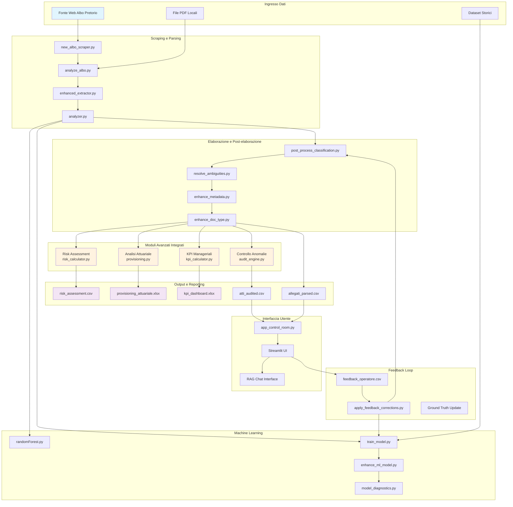

# Diagrammi dell'Architettura del Sistema

## Diagramma Mermaid: Flusso Completo del Sistema con Moduli Avanzati



## Dendrogramma Concettuale: Gerarchia dei Moduli del Sistema

Il seguente diagramma rappresenta la struttura gerarchica dei moduli del sistema, mostrando come i diversi componenti sono organizzati in una struttura ad albero gerarchico:

```
Sistema di Audit dell'Albo Pretorio
├── Core System
│   ├── Parsing Layer
│   │   ├── Basic Parser
│   │   ├── Enhanced Extractor
│   │   └── Analyzer
│   ├── ML Engine
│   │   ├── RandomForest Classifier
│   │   ├── Model Trainer
│   │   ├── Model Enhancer
│   │   └── Model Diagnostics
│   └── Data Processor
│       ├── Post-processor
│       ├── Ambiguity Resolver
│       ├── Metadata Enhancer
│       └── Doc Type Enhancer
├── Advanced Modules
│   ├── Risk Assessment
│   │   ├── Risk Calculator
│   │   └── Risk Scoring
│   ├── Actuarial Analysis
│   │   ├── Provisioning Calculator
│   │   └── Survival Analysis
│   ├── Management KPIs
│   │   ├── Efficiency Metrics
│   │   ├── Effectiveness Metrics
│   │   ├── Economy Metrics
│   │   └── Transparency Metrics
│   └── Audit Engine
│       ├── Anomaly Detection
│       └── Compliance Checking
├── User Interface
│   ├── Streamlit Control Room
│   ├── RAG Interface
│   └── Visualization Tools
├── Data Flow
│   ├── Input Sources
│   ├── Processing Pipeline
│   ├── Output Generation
│   └── Feedback Loop
└── Quality Assurance
    ├── Validation Tools
    ├── Statistics Analysis
    └── Continuous Improvement
```

## Descrizione dei Livelli

### 1. Core System
Livello fondamentale del sistema che gestisce l'estrazione e l'elaborazione iniziale dei dati.

### 2. Advanced Modules
Moduli specializzati che implementano competenze professionali avanzate:
- **Risk Assessment**: Valutazione del rischio basata su importo, urgenza, ricorrenza fornitori
- **Analisi Attuariale**: Calcoli attuariari per la stima degli impegni finanziari
- **Management KPIs**: Indicatori di governance ed efficienza amministrativa

### 3. User Interface
Interfaccia utente che consente l'interazione con il sistema e la supervisione umana.

### 4. Data Flow
Gestione del flusso dei dati attraverso il sistema, inclusi i feedback loop.

### 5. Quality Assurance
Componenti per garantire la qualità e l'affidabilità del sistema.

## Interazioni tra Moduli

I moduli comunicano attraverso:
- File CSV intermedi
- Comandi CLI standardizzati
- Feedback loop per l'apprendimento continuo
- API interne per l'integrazione

Questa architettura modulare permette l'espansione e la manutenzione del sistema mantenendo la scalabilità e la qualità.