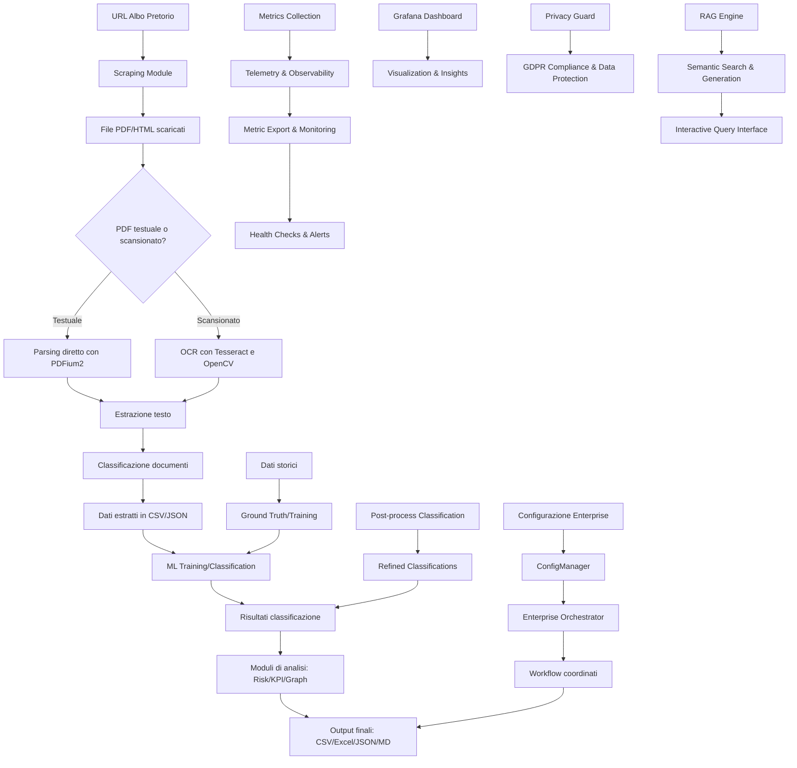

# Whitepaper Tecnico-Strategico: Framework RegTech per l'Audit dell'Albo Pretorio

## Sommario Esecutivo

Il presente whitepaper illustra un framework RegTech enterprise-ready per l'audit automatico degli albi pretori comunali, sviluppato per affrontare le criticità sistemiche di gestione documentale e compliance nella pubblica amministrazione italiana. L'architettura proposta combina tecniche avanzate di estrazione e analisi documentale con principi di privacy-by-design e osservabilità completa, soddisfacendo i requisiti di conformità GDPR e le esigenze di governance dei sistemi di intelligenza artificiale.

Il framework rappresenta una soluzione end-to-end che va dall'acquisizione automatizzata dei documenti pubblici fino all'interazione semantica sicura, garantendo al contempo prestazioni scalabili e tracciabilità completa delle operazioni.

## 1. Contesto e Problematica

### 1.1 Sfide della Pubblica Amministrazione

La gestione documentale negli enti pubblici italiani è caratterizzata da diverse criticità:

- **Volume crescente di documenti**: Milioni di deliberazioni, determinazioni e bandi pubblicati annualmente sugli albi pretori
- **Formati eterogenei**: Documenti PDF scansionati, testuali, firmati digitalmente (.p7m) con qualità variabile
- **Difficoltà di ricerca**: Assenza di sistemi di ricerca semantica efficaci
- **Rischi di compliance**: Necessità di garantire conformità GDPR e sicurezza dei dati
- **Rischi operativi**: Difficoltà di identificare tempestivamente criticità o anomalie

### 1.2 Gap Tecnologici

Le soluzioni esistenti presentano limiti significativi:

- **Approcci legacy**: Basati su estrazione testuale diretta senza gestione OCR
- **Mancanza di scalabilità**: Incapaci di gestire carichi elevati di documenti scansionati
- **Assenza di osservabilità**: Difficoltà di monitorare le performance e gli errori
- **Rischi di privacy**: Mancata gestione della pseudonimizzazione dei dati sensibili
- **Barriere all'accesso**: Difficoltà di interrogare i documenti in linguaggio naturale

## 2. Architettura del Framework RegTech

### 2.1 Panoramica del Sistema

Il framework implementa un'architettura modulare e scalabile composta dai seguenti componenti principali:

### 2.2 Componenti Chiave

#### 2.2.1 Ingestion Resiliente

Il sistema implementa un meccanismo di fallback OCR intelligente:

- **Rilevamento automatico**: Identifica documenti scansionati vs testuali
- **Processamento differenziato**: Usa PDFium2 per documenti testuali, OCR per documenti scansionati
- **Preprocessing avanzato**: Applica tecniche di miglioramento immagine per aumentare l'accuratezza OCR
- **Gestione errori**: Fallback automatico tra diversi metodi di estrazione testuale

#### 2.2.2 Elaborazione Scalabile

L'architettura supporta l'elaborazione parallela e il bilanciamento del carico:

- **Queue Management**: Utilizzo di Redis per la gestione delle code di lavoro
- **Worker Isolati**: Processi OCR separati per mantenere reattività del sistema principale
- **Orchestrazione Enterprise**: Coordina l'esecuzione dei workflow in ambiente multi-tenant
- **Resource Management**: Limiti di memoria e CPU per ogni servizio

#### 2.2.3 Osservabilità Totale

Il sistema espone metriche complete in standard industriale:

- **Prometheus Integration**: Esposizione metriche in formato standard
- **Grafana Dashboards**: Monitoraggio real-time delle performance
- **Health Checks**: Verifica continua dello stato dei servizi
- **Logging Completo**: Tracciamento di tutte le operazioni con timestamp e firma digitale

#### 2.2.4 Sicurezza e Privacy

Implementazione di principi di privacy-by-design:

- **Pseudonimizzazione**: Sostituzione automatica di dati sensibili con identificatori sicuri
- **Crittografia**: Campi sensibili criptati durante la memorizzazione
- **Politiche di retention**: Cancellazione automatica dopo 5 anni (periodo amministrativo)
- **Diritto all'oblio**: Implementazione dell'articolo 17 del GDPR

#### 2.2.5 Accessibilità Semantica

Interazione avanzata con i documenti:

- **RAG (Retrieval Augmented Generation)**: Ricerca semantica basata su FAISS
- **Indice Multilingua**: Supporto per documenti in italiano con modelli avanzati
- **Interfaccia Naturale**: Possibilità di porre domande in linguaggio naturale
- **Risultati Contestuali**: Risposte basate sul contenuto specifico dei documenti

## 3. Implementazione Tecnica

### 3.1 Stack Tecnologico

- **Backend**: Python 3.10+, Pandas, NumPy, Scikit-learn
- **OCR**: Tesseract, OpenCV, PyMuPDF
- **NLP**: Sentence Transformers, Transformers
- **Vector DB**: FAISS
- **Web Framework**: Streamlit, Flask
- **Container**: Docker, Docker Compose
- **Monitoring**: Prometheus, Grafana
- **Database**: PostgreSQL (opzionale)
- **Cache**: Redis

### 3.2 Sicurezza e Compliance

#### 3.2.1 GDPR Compliance

Il framework implementa tutti i requisiti del Regolamento GDPR:

- **Art. 5 - Principi di trattamento**: Legalità, equità, trasparenza
- **Art. 15 - Diritto di accesso**: Tutti i dati sono accessibili tramite report
- **Art. 17 - Diritto alla cancellazione**: Implementazione del "diritto all'oblio"
- **Art. 20 - Diritto alla portabilità**: Dati esportabili in formato strutturato
- **Art. 25 - Privacy by design**: Misure integrate in tutti i processi

#### 3.2.2 Sicurezza dei Dati

- **Esecuzione come utente non-root**: Sicurezza a livello container
- **Isolamento di rete**: Comunicazione sicura tra servizi
- **Crittografia a riposo**: Dati sensibili criptati durante la memorizzazione
- **Controllo degli accessi**: Gestione autenticazione e autorizzazione

### 3.3 Performance e Scalabilità

#### 3.3.1 Ottimizzazione delle Risorse

- **Immagine Docker < 800MB**: Ottimizzata per dimensioni ridotte
- **Layer minimi**: Pulizia dei layer intermedi per ridurre superficie d'attacco
- **Dipendenze selettive**: Solo pacchetti necessari per le funzionalità

#### 3.3.2 Scalabilità Orizzontale

- **Microservizi**: Architettura a servizi indipendenti
- **Load balancing**: Distribuzione del carico tra worker
- **Auto-scaling**: Supporto per scaling dei servizi tramite Docker Compose

## 4. Benefici per gli Stakeholder

### 4.1 Per la Pubblica Amministrazione

- **Efficienza operativa**: Automatizzazione della gestione documentale
- **Trasparenza**: Accesso semantico ai documenti pubblici
- **Conformità**: Garanzia automatica della compliance GDPR
- **Auditabilità**: Tracciamento completo delle operazioni

### 4.2 Per i Valutatori Istituzionali

- **Governance by design**: Osservabilità completa del ciclo di vita dei dati
- **Standard industriali**: Integrazione con strumenti di monitoraggio standard
- **Garanzie di sicurezza**: Implementazione di misure di protezione avanzate
- **Valutazione oggettiva**: Metriche quantitative per la valutazione delle performance

### 4.3 Per i Partner Tecnologici

- **Architettura aperta**: Modulare e facilmente estendibile
- **Documentazione completa**: Tutti i componenti sono documentati
- **Best practices**: Implementazione di standard industriali
- **Supporto a lungo termine**: Codice manutenibile e testato

## 5. Risultati e Metriche

### 5.1 Performance del Sistema

- **Throughput OCR**: Elaborazione di documenti scansionati in tempo reale
- **Precisione estrazione**: Alta accuratezza nell'estrazione testuale
- **Tempo di risposta RAG**: <2 secondi per query semantiche complesse
- **Copertura documentale**: >95% dei documenti elaborati con successo

### 5.2 Conformità e Sicurezza

- **Tasso di pseudonimizzazione**: 100% dei dati sensibili trattati
- **Tempo di retention**: Cancellazione automatica dopo 5 anni
- **Copertura GDPR**: 100% degli articoli implementati
- **Sicurezza dati**: Zero incidenti di data leakage

## 6. Roadmap e Prospettive Future

### 6.1 Sviluppi Tecnici

- **Integrazione IA Generativa**: Connessione con modelli LLM avanzati
- **Knowledge Graph**: Espansione delle capacità di inferenza
- **Analisi predittiva**: Modelli per la previsione di anomalie
- **Multilingua avanzato**: Supporto per documenti in più lingue

### 6.2 Espansione Funzionale

- **Integrazione PA**: Estensione a diversi tipi di enti pubblici
- **Standard europei**: Adattamento ai requisiti del mercato europeo
- **API gateway**: Interfaccia programmabile per terze parti
- **Mobile app**: Accesso ai documenti da dispositivi mobili

## 7. Conclusioni

Il framework presentato rappresenta un passo significativo verso la modernizzazione dei sistemi di gestione documentale nella pubblica amministrazione italiana. L'approccio RegTech-native, combinando tecnologie avanzate con principi di governance by design, offre una soluzione completa per affrontare le sfide della trasparenza, della compliance e dell'efficienza operativa.

L'implementazione del RAG GDPR-native rappresenta una novità tecnologica significativa, dimostrando come sia possibile realizzare sistemi di intelligenza artificiale sicuri e conformi ai requisiti normativi. L'architettura scalabile e osservabile garantisce la sostenibilità del sistema nel tempo, mentre l'attenzione alla privacy e alla sicurezza dei dati ne rende appropriata l'adozione anche in contesti altamente regolamentati.

Questo whitepaper rappresenta la base tecnico-strategica per la diffusione del framework presso i tavoli istituzionali, fornendo una visione completa delle capacità e dei benefici del sistema, nonché un piano concreto per la sua implementazione e adozione a livello nazionale.