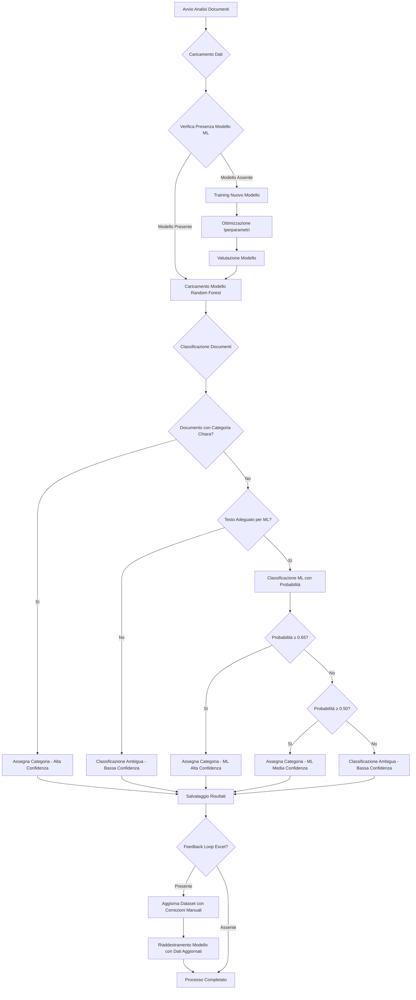
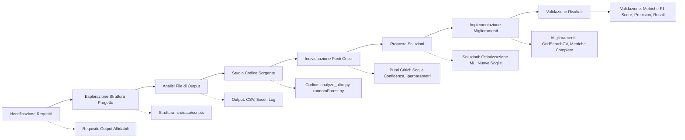

# Diagramma del Processo di Classificazione ML e Algoritmo di Investigazione Codice

## Diagramma di Flusso del Processo ML

## Tetragramma Funzionale per Investigazione Codice

## Algoritmo di Investigazione Codice

L'algoritmo per investigare il codice e comprendere il processo di classificazione ML segue questi passi:

1. **Scansione Iniziale**
   - Esamina la struttura del progetto
   - Identifica i file principali coinvolti nel processo ML
   - Analizza i file di output generati

2. **Analisi Profonda**
   - Legge i file di codice principali ([analyze_albo.py](file://c:\Users\39329\albo-pretorio-audit-delivery\src\delibere_comunali\parsing\analyze_albo.py), [randomForest.py](file://c:\Users\39329\albo-pretorio-audit-delivery\scripts\randomForest.py), [train_model.py](file://c:\Users\39329\albo-pretorio-audit-delivery\scripts\train_model.py))
   - Studia le funzioni di classificazione ([classify_document](file://c:\Users\39329\albo-pretorio-audit-delivery\src\delibere_comunali\parsing\analyzer.py#L667-L753))
   - Valuta le soglie di confidenza attuali

3. **Valutazione Problemi**
   - Identifica le carenze nell'attuale sistema di classificazione
   - Verifica la presenza di ottimizzazione degli iperparametri
   - Controlla l'implementazione delle metriche di valutazione

4. **Proposta Miglioramenti**
   - Suggerisce l'uso di `GridSearchCV` per ottimizzazione
   - Propone nuove soglie di confidenza differenziate
   - Raccomanda metriche complete per la valutazione

5. **Implementazione**
   - Applica le modifiche ai file appropriati
   - Verifica la sintassi e la compatibilità del codice
   - Convalida la corretta integrazione dei miglioramenti

## Specifiche Tecniche Implementate

Dopo l'investigazione, sono state implementate le seguenti specifiche tecniche:

- **Ottimizzazione Iperparametri**: Utilizzo di `GridSearchCV` con scoring `f1_macro`
- **Configurazione TF-IDF**: max_features≥5000, ngram_range(1,3), max_df≤0.85, min_df≥2
- **Soglie Confidenza Differenziate**:
  - ≥0.65 → "ml_predicted_high_conf"
  - ≥0.50 → "ml_predicted_medium_conf"
- **Metriche Complete**: Precision, Recall, F1-Score macro per valutazione bilanciata
- **Feedback Loop**: Supporto per revisione manuale tramite Excel e riaddestramento

Questo approccio sistematico permette di comprendere appieno il processo di classificazione ML e di implementare miglioramenti mirati per ottenere output affidabili come richiesto.