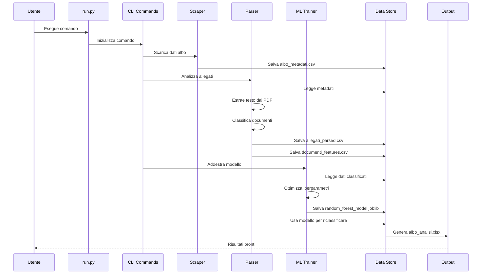

# Diagramma delle Relazioni del Progetto

## Architettura Generale

```mermaid
graph TB
    subgraph "Interfaccia Utente e CLI"
        A[run.py] --> B[CLI Commands]
        B --> C[delibere_comunali.cli]
    end

    subgraph "Componenti Principali"
        C --> D[Parsing]
        C --> E[Scraping]
        C --> F[ML Components]
        C --> G[Analysis]
        C --> H[Export]
        C --> I[Validation]
        C --> J[Visualization]
        C --> K[Knowledge Graph]
        C --> L[RAG]
    end

    subgraph "Parsing"
        D --> DA[analyze_albo.py]
        D --> DB[analyzer.py]
        D --> DC[enhanced_extractor.py]
        D --> DD[extractor.py]
    end

    subgraph "Scraping"
        E --> EA[new_albo_scraper.py]
        E --> EB[web_utils.py]
        E --> EC[scraper_config.py]
    end

    subgraph "Machine Learning"
        F --> FA[randomForest.py - scripts]
        F --> FB[train_model.py - scripts]
        F --> FC[trainer.py]
        F --> FD[ground_truth.py]
    end

    subgraph "Scripts Esterni"
        M[External Scripts]
        M --> MA[analyze_topology.py]
        M --> MB[detect_anomalies.py]
        M --> MC[explore_albo.py]
        M --> MD[generate_ground_truth.py]
        M --> ME[validate_output.py]
        M --> MF[clean_texts.py]
        M --> MG[export_linked_data.py]
        M --> MH[finance_validator.py]
    end

    subgraph "Data Flow"
        EA --> N[data/albo_download/]
        DA --> N
        FA --> N
        FB --> N
        N --> O[albo_metadati.csv]
        N --> P[allegati_parsed.csv]
        N --> Q[documenti_features.csv]
        N --> R[albo_analisi.xlsx]
        N --> S[random_forest_model.joblib]
        N --> T[report/]
        N --> U[texts/]
    end

    subgraph "Output Elaborati"
        V[Output Processed]
        V --> W[atti_parsed.csv]
        V --> X[feedback_operatore.csv]
        V --> Y[anomalies.json]
        V --> Z[procedures.json]
    end

    subgraph "Utilità e Servizi"
        AA[delibere_comunali.utils]
        AB[delibere_comunali.services]
        AC[delibere_comunali.models]
    end

    subgraph "Intelligenza Artificiale e RAG"
        AD[delibere_comunali.ml]
        AE[delibere_comunali.rag]
        AF[delibere_comunali.knowledge_graph]
    end

    subgraph "Validazione e Controllo"
        AG[delibere_comunali.validation]
        AH[validate_output.py]
        AI[validate_statistics.py]
        AJ[validate_ground_truth.py]
    end

    subgraph "Visualizzazione"
        AK[delibere_comunali.visualization]
        AL[visualizza_grafo.py]
    end

    subgraph "Configurazione"
        AM[pyproject.toml]
        AN[requirements.txt]
        AO[.env]
    end

    subgraph "Documentazione"
        AP[README.md]
        AQ[ARCHITECTURE.md]
        AR[DATA_SCHEMA.md]
        AS[API_DOCUMENTATION.md]
    end

    %% Connessioni principali
    DA -.-> S
    DB -.-> S
    FA -.-> S
    FB -.-> S
    DA -.-> P
    DA -.-> Q
    DA -.-> R
    EA -.-> O
    DA --> AA
    DA --> AC
    EA --> AA
    EA --> AC
    FA --> AC
    FB --> AC
    M --> N
    AA --> AC
    AB --> AC
    AD --> AC
    AE --> AC
    AF --> AC
    AG --> AC
    AK --> AC
    AP --> A
    AM --> A
    AN --> A

    %% Stile per evidenziare i componenti principali
    classDef coreComponent fill:#e1f5fe,stroke:#01579b,stroke-width:2px
    classDef dataFlow fill:#f3e5f5,stroke:#4a148c,stroke-width:2px
    classDef scriptComponent fill:#fff3e0,stroke:#e65100,stroke-width:2px

    class A,B,C,D,E,F,G,H,I,J,K,L,M coreComponent
    class N,O,P,Q,R,S,T,U,V,W,X,Y,Z dataFlow
    class MA,MB,MC,MD,ME,MF,MG,MH scriptComponent
```



## Flusso di Esecuzione Tipico



## Dipendenze e Interazioni

```mermaid
graph RL
    subgraph "Input/Output"
        A[albo_metadati.csv]
        B[allegati_parsed.csv]
        C[documenti_features.csv]
        D[albo_analisi.xlsx]
        E[random_forest_model.joblib]
        F[atti_parsed.csv]
    end

    subgraph "Processori"
        G[analyze_albo.py]
        H[new_albo_scraper.py]
        I[randomForest.py]
        J[train_model.py]
        K[analyzer.py]
    end

    subgraph "Modelli e Servizi"
        L[delibere_comunali.ml]
        M[delibere_comunali.utils]
        N[delibere_comunali.models]
    end

    %% Relazioni
    H --> A
    G --> A
    G --> B
    G --> C
    G --> D
    I --> E
    J --> E
    G --> E
    I --> B
    J --> B
    G --> F
    K --> G
    G --> K
    L --> I
    L --> J
    M --> G
    M --> H
    M --> I
    M --> J
    N --> G
    N --> H
    N --> I
    N --> J
    N --> K
    A --> G
    A --> H
    B --> G
    B --> I
    B --> J
    C --> G
    C --> I
    C --> J
    E --> G
    E --> K
}
```

## Descrizione delle Relazioni

### Componenti Principali:
- **[run.py](file://c:\Users\39329\albo-pretorio-audit-delivery\run.py)**: Punto di ingresso principale dell'applicazione
- **[new_albo_scraper.py](file://c:\Users\39329\albo-pretorio-audit-delivery\src\delibere_comunali\scraping\new_albo_scraper.py)**: Scarica i dati dall'albo pretorio
- **[analyze_albo.py](file://c:\Users\39329\albo-pretorio-audit-delivery\src\delibere_comunali\parsing\analyze_albo.py)**: Analizza i documenti PDF e li classifica
- **[randomForest.py](file://c:\Users\39329\albo-pretorio-audit-delivery\scripts\randomForest.py)**: Addestra il modello ML con ottimizzazione degli iperparametri
- **[train_model.py](file://c:\Users\39329\albo-pretorio-audit-delivery\scripts\train_model.py)**: Script alternativo per il training del modello

### Flusso dei Dati:
1. Lo scraper ottiene i metadati e li salva in [albo_metadati.csv](file://c:\Users\39329\albo-pretorio-audit-delivery\data\albo_download\albo_metadati.csv)
2. Il parser estrae e classifica i documenti, salvando i risultati in [allegati_parsed.csv](file://c:\Users\39329\albo-pretorio-audit-delivery\data\albo_download\allegati_parsed.csv) e [documenti_features.csv](file://c:\Users\39329\albo-pretorio-audit-delivery\data\albo_download\documenti_features.csv)
3. I modelli ML vengono addestrati usando questi dati e salvati come [random_forest_model.joblib](file://c:\Users\39329\albo-pretorio-audit-delivery\data\albo_download\random_forest_model.joblib)
4. I risultati finali vengono aggregati in [albo_analisi.xlsx](file://c:\Users\39329\albo-pretorio-audit-delivery\data\albo_download\albo_analisi.xlsx)

### Interazioni Critiche:
- La funzione [classify_document](file://c:\Users\39329\albo-pretorio-audit-delivery\src\delibere_comunali\parsing\analyzer.py#L667-L753) in [analyzer.py](file://c:\Users\39329\albo-pretorio-audit-delivery\src\delibere_comunali\parsing\analyzer.py) e [analyze_albo.py](file://c:\Users\39329\albo-pretorio-audit-delivery\src\delibere_comunali\parsing\analyze_albo.py) utilizza il modello ML caricato
- I file di script come [randomForest.py](file://c:\Users\39329\albo-pretorio-audit-delivery\scripts\randomForest.py) e [train_model.py](file://c:\Users\39329\albo-pretorio-audit-delivery\scripts\train_model.py) interagiscono direttamente con i dati in [data/albo_download/](file://c:\Users\39329\albo-pretorio-audit-delivery\data\albo_download)
- I dati vengono persistiti e condivisi tra i diversi componenti attraverso i file CSV e il modello joblib

Questo diagramma mostra come tutti i componenti del progetto sono interconnessi e come i dati fluiscono attraverso il sistema per consentire l'analisi e la classificazione automatica dei documenti dell'albo pretorio.